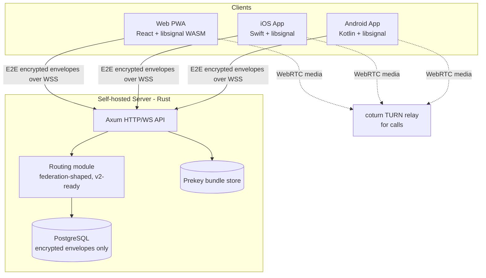

# INSTALL.md - UmbraChat

Technical vision and installation guide.

## Vision

E2E encrypted messenger — messages, files, voice/video calls, and groups — architected so no party (including the server operator) can access plaintext content, resistant to mandated client-side content scanning.

UmbraChat is an open-source, self-hostable messenger built for people who want Signal-grade end-to-end encryption without depending on a single company or jurisdiction. It targets a small, privacy-conscious community (under 1,000 users at launch) and is designed so anyone can eventually run their own server and interoperate with others.

## Decisions

| Decision     | Choice                                                          | Why                                                                                                                    |
| ------------ | ---------------------------------------------------------------- | ------------------------------------------------------------------------------------------------------------------------ |
| Architecture | Monolith, self-hosted, single server (federation-shaped schema)  | Fits solo maintenance and $0 budget; global-namespaced user IDs and a routing module kept separate from storage reduce the cost of adding real federation in v2 |
| Front-end    | React PWA (Vite) + official libsignal WASM bindings              | No SEO need, so SPA is sufficient; PWA avoids app-store friction for web users; official bindings mean zero crypto-binding risk |
| Back-end     | Rust — Axum + Tokio + official `libsignal-client` crate          | Eliminates the binding-risk found during the stack audit (no official Go or React Native bindings exist); memory safety matters directly for a server handling keys and ciphertext |
| Database     | PostgreSQL via `sqlx`                                            | Relational, free to self-host, mature async Rust driver, no ORM overhead                                                |
| Auth         | Self-sovereign key-based identity (libsignal identity keys)      | Matches the zero-knowledge goal; avoids third-party auth providers, all of which are either paid or SaaS-dependent, conflicting with the no-paid-tech constraint |
| Hosting      | Self-hosted VM (e.g. Oracle Cloud Always Free) + Vercel free tier for web | Only path to a genuine, permanent $0/month; self-hosting also matches the long-term goal of letting anyone run their own node |

## Stack summary

- **Front-end:** React 18 (Vite) PWA, `wasm-crypto` — a thin `wasm-bindgen` wrapper we build ourselves around the official `libsignal-protocol` Rust crate (Signal publishes no browser/WASM build; `@signalapp/libsignal-client` is Node-only)
- **Mobile:** Swift on iOS (official libsignal Swift bindings), Kotlin on Android (official libsignal Java bindings) — sideloaded (AltStore/SideStore on iOS, direct APK on Android), no app-store fees
- **Back-end:** Rust, Axum + Tokio, `libsignal-client` crate, `sqlx`
- **Database:** PostgreSQL 16
- **Auth:** libsignal identity keys (X3DH + Double Ratchet), no third-party provider
- **Hosting:** Self-hosted VM (Oracle Cloud Always Free ARM or equivalent) for the server + Postgres; Vercel free tier for the web PWA
- **Key integrations:** coturn (TURN relay for WebRTC calls)

## Architecture



The three clients (web, iOS, Android) each hold the decryption keys locally and talk to the server only over WSS. The server's `Routing` module stores and delivers encrypted envelopes and public prekey bundles — it never has the keys needed to read content. The `Routing` module is kept as a separate boundary from raw storage specifically so that federated, server-to-server delivery can be added later without redesigning the schema.

## Folder structure

```
umbra-chat/
├── server/                 # Rust backend
│   ├── src/
│   │   ├── main.rs
│   │   ├── routes/         # HTTP/WebSocket handlers
│   │   ├── crypto/         # prekey bundle handling (X3DH) — never touches plaintext
│   │   ├── db/              # sqlx queries, models
│   │   ├── federation/      # routing module, kept separate from storage (federation-shaped, v2-ready)
│   │   └── calls/           # WebRTC signaling + TURN coordination
│   ├── migrations/          # Postgres schema migrations
│   └── Cargo.toml
├── web/                     # React PWA
│   ├── src/
│   └── package.json
├── ios/                     # Native Swift app
│   └── UmbraChat.xcodeproj
├── android/                 # Native Kotlin app
│   └── build.gradle.kts
├── docs/                    # protocol notes, ADRs
└── aidd_docs/                # AIDD project memory, INSTALL.md
```

## Install steps

Manual install - the framework does not yet scaffold these automatically.

1. Init the git repo and create the folder structure above.
2. Install the Rust toolchain (`rustup`), Node.js + a package manager (npm/pnpm) for the web client, Xcode for iOS, and Android Studio for Android.
3. Create a free-tier VM (e.g. an Oracle Cloud Always Free ARM instance) to self-host the server and database.
4. Install PostgreSQL 16 on the VM (or run it via Docker) and create the `umbra_chat` database.
5. Set environment variables: `DATABASE_URL`, server signing/config secrets, and TURN server credentials.
6. Deploy `coturn` (TURN relay) on the same VM to handle WebRTC call relaying when peer-to-peer isn't possible.
7. Deploy the web PWA to Vercel's free tier, pointing it at the self-hosted API's domain.

## Audit summary

Results of the multi-agent audit run during action 03:

| Candidate                                | Verdict | Notes                                                                                                   |
| ----------------------------------------- | ------- | --------------------------------------------------------------------------------------------------------- |
| A — Matrix-based (fork Element)           | ⚠️      | Mature, fast to ship, but Matrix federation exposes sender/recipient/timing metadata by design — doesn't meet the zero-knowledge goal |
| B — Custom federated (libsignal + RN)     | ❌      | No maintained React Native binding for libsignal; designing a federation trust/spam protocol from scratch is a multi-year problem, not solo-viable at $0 |
| C — Custom, centralized-first (**picked**) | ⚠️→ resolved | Original Go pick had no official libsignal binding; resolved by switching to Rust (official `libsignal-client`) for the backend and native Swift/Kotlin (official bindings) for mobile. Federation-deferral risk mitigated via federation-shaped schema (global user IDs, separate routing module). $0 hosting risk (free-tier reclaim, TURN bandwidth) remains an operational risk to monitor, not an architectural one |
