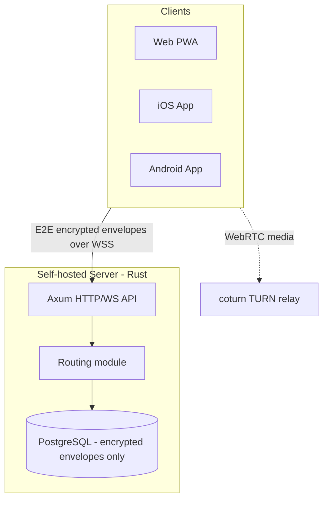

# Architecture

Full stack rationale and the audit that produced it: [`aidd_docs/INSTALL.md`](../INSTALL.md).

## Stack

- Back-end: Rust (Axum + Tokio), using the official `libsignal-client` crate directly — no community port, no hand-rolled crypto
- Web: React PWA (Vite), using `wasm-crypto` — our own `wasm-bindgen` wrapper around the same official `libsignal-protocol` crate the server uses (Signal ships no browser/WASM build of its own; their "web" client is Electron, a Node runtime)
- Mobile: native Swift (iOS) and native Kotlin (Android), each using libsignal's official Swift/Java bindings — not React Native, to avoid the unofficial-binding risk that ruled out the other candidates
- Database: PostgreSQL via `sqlx` (async, compile-time-checked queries, no ORM)

## How it fits together

## Key decisions

- The server stays zero-knowledge (see [`project-brief.md`](project-brief.md) for the term) end to end: every route and module must be checked against that guarantee before it ships.
- Federation is deferred to v2, but the schema is federation-shaped from day one (global-namespaced user IDs, a `routing` module kept separate from storage) specifically to avoid the rearchitecture that retrofitting federation usually forces.
- Rust was picked over Go for the backend because `libsignal-client` has no official Go binding (only Rust/Swift/Kotlin/Node); using Rust everywhere it's needed (server + can share crypto reasoning with native clients) eliminates that risk entirely rather than mitigating it.
- A Matrix-based stack (fork of Element/Synapse) was audited and rejected: mature and fast to ship, but Matrix federation exposes sender/recipient/timing metadata between homeservers by design, which conflicts with this project's zero-knowledge goal.
- Hosting is entirely free-tier: a self-hosted VM (e.g. Oracle Cloud Always Free) for the server, database, and TURN relay, plus Vercel's free tier for the web PWA. This is a hard, permanent constraint, not a bootstrap-phase choice.

## Gotchas

- iOS has no App Store or paid-developer-account distribution path (the project has a $0 hard budget). It ships via AltStore/SideStore sideloading with a free Apple ID, which means the app needs re-signing roughly every 7 days — a real UX cost, accepted deliberately.
- `@signalapp/libsignal-client` (npm) is a native Node addon, not a browser build — it cannot run in the web PWA. Discovered by inspecting its `package.json` (`node-gyp-build` dependency, no `browser` field) and confirming no `wasm32` target exists anywhere in the `signalapp/libsignal` source. The `wasm-crypto` crate exists specifically to fill this gap.
- Session establishment is **PQXDH, not classic X3DH**: `libsignal-protocol`'s `PreKeyBundle::new()` requires a Kyber1024 signed prekey as a mandatory constructor argument, and `process_prekey_bundle()` unconditionally verifies its signature. Every account's registration bundle (server schema, `wasm-crypto` generation, web client) includes a `kyber_signed_prekey` alongside the classic EC signed prekey — discovered mid-way through building 1:1 messaging (issue #2), after issue #1's registration flow had already shipped without it, requiring a retroactive fix.
- `std::time::SystemTime::now()` panics on bare `wasm32-unknown-unknown` (no OS clock), and `libsignal-protocol`'s session functions (`process_prekey_bundle`, `message_encrypt`) take `std::time::SystemTime` specifically — can't just swap in `web_time::SystemTime` (a distinct type). Fix: read the clock via `web_time` (bridges to `Date.now()`) and rebuild a `std::time::SystemTime` from its millisecond offset via `UNIX_EPOCH + Duration`, which needs no clock itself. Same family of gotcha as the `getrandom` wasm backend issue in issue #1's phase 2.
- `InMemSignalProtocolStore`'s sub-stores (`session_store`, `identity_store`, `pre_key_store`, etc.) are public fields specifically so callers can take several simultaneous disjoint `&mut` borrows (one per trait) when calling functions like `message_decrypt` that need 4-5 different store traits at once — borrowing `&mut self.inner` as a whole for each parameter does not compile.
