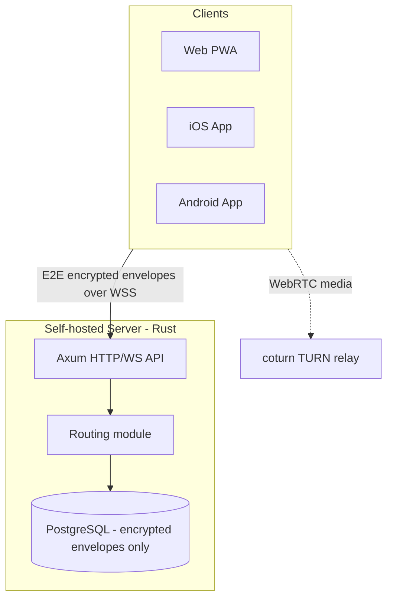

# Architecture

Full stack rationale and the audit that produced it: [`aidd_docs/INSTALL.md`](../INSTALL.md).

## Stack

- Back-end: Rust (Axum + Tokio), using the official `libsignal-client` crate directly — no community port, no hand-rolled crypto
- Web: React PWA (Vite), using Signal's official WASM/Node `libsignal-client` build
- Mobile: native Swift (iOS) and native Kotlin (Android), each using libsignal's official Swift/Java bindings — not React Native, to avoid the unofficial-binding risk that ruled out the other candidates
- Database: PostgreSQL via `sqlx` (async, compile-time-checked queries, no ORM)

## How it fits together

## Key decisions

- The server stays zero-knowledge (see [`project-brief.md`](project-brief.md) for the term) end to end: every route and module must be checked against that guarantee before it ships.
- Federation is deferred to v2, but the schema is federation-shaped from day one (global-namespaced user IDs, a `routing` module kept separate from storage) specifically to avoid the rearchitecture that retrofitting federation usually forces.
- Rust was picked over Go for the backend because `libsignal-client` has no official Go binding (only Rust/Swift/Kotlin/Node); using Rust everywhere it's needed (server + can share crypto reasoning with native clients) eliminates that risk entirely rather than mitigating it.
- A Matrix-based stack (fork of Element/Synapse) was audited and rejected: mature and fast to ship, but Matrix federation exposes sender/recipient/timing metadata between homeservers by design, which conflicts with this project's zero-knowledge goal.
- Hosting is entirely free-tier: a self-hosted VM (e.g. Oracle Cloud Always Free) for the server, database, and TURN relay, plus Vercel's free tier for the web PWA. This is a hard, permanent constraint, not a bootstrap-phase choice.

## Gotchas

- iOS has no App Store or paid-developer-account distribution path (the project has a $0 hard budget). It ships via AltStore/SideStore sideloading with a free Apple ID, which means the app needs re-signing roughly every 7 days — a real UX cost, accepted deliberately.
