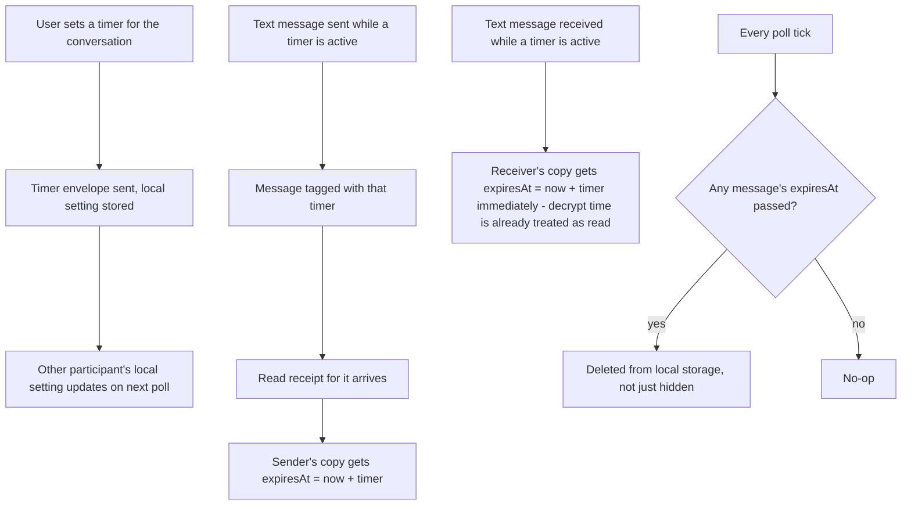

# Instruction: Timer envelope, per-message expiry, hard delete

## Architecture projection

> Tree of the final files. ✅ create · ✏️ modify · ❌ delete

```txt
.
└── web/
    └── src/
        ├── chat/conversation.ts       ✏️
        └── storage/messageStore.ts    ✏️
```

## User Journey



## Tasks to do

### 1) Timer envelope and local per-contact setting

> A control envelope, same shape as the existing receipt envelopes - not shown as a chat message.

1. `chat/conversation.ts`: add `TimerEnvelope { type: "timer", seconds: number }` to the `Envelope` union
2. Two small localStorage helpers next to the envelope types, keyed `umbrachat:timer:${contactId}`: `getTimerSeconds(contactId): number` (default `0` = off), `setTimerSecondsLocal(contactId, seconds): void` - same pattern as `App.tsx`'s existing `ACTIVE_CONTACT_KEY`, no new storage module
3. `export async function setDisappearingTimer(contactId, seconds, account, store)`: build and send a `TimerEnvelope` through the existing encrypted pipe (`store.encrypt` + `sendMessage`, `persistSession` after), then call `setTimerSecondsLocal`
4. In `poll()`: handle `envelope.type === "timer"` by calling `setTimerSecondsLocal(contactId, envelope.seconds)` - no chat message pushed

### 2) Tag messages with the active timer, compute expiry at read time

> The timer active when a message is created travels with it; expiry is set once, at read time, and never recomputed.

1. `storage/messageStore.ts`: add `timerSeconds?: number` and `expiresAt?: string` (ISO, like `createdAt`) to `ChatMessage`
2. `chat/conversation.ts::sendText`: read `getTimerSeconds(contactId)`; if `> 0`, set `timerSeconds` on the pushed sent message (no `expiresAt` yet - the sender doesn't know it's been read)
3. `chat/conversation.ts::poll`, text-received branch: read `getTimerSeconds(contactId)`; if `> 0`, set `expiresAt = now + seconds * 1000` directly on the pushed received message (decrypt time is already this app's "read" moment)
4. `chat/conversation.ts::poll`, receipt branch: when `envelope.type === "read"` and the matched sent message has `timerSeconds` set and no `expiresAt` yet, set `expiresAt = now + timerSeconds * 1000` on it

### 3) Sweep and hard-delete expired messages every poll

> Deletion actually removes the row from IndexedDB, not a filtered view.

1. `chat/conversation.ts::poll`: after building the updated `messages` array (before returning), filter out any message whose `expiresAt` has passed; save whenever either new messages arrived or the sweep removed something (not only on `received.length > 0` as today)

## Test acceptance criteria

| Task | Acceptance criteria              |
| ---- | -------------------------------- |
| 1 | Setting a timer on one side updates the other participant's stored timer setting after their next poll |
| 2 | A message sent while a timer is active only gets its `expiresAt` set once the sender receives the read receipt for it, not at send time |
| 2 | A message received while a timer is active gets `expiresAt` set immediately |
| 2 | Changing the timer after a message already has `timerSeconds`/`expiresAt` set does not alter that message |
| 3 | Once a message's `expiresAt` has passed, the next poll removes it from IndexedDB - reloading history no longer shows it |
