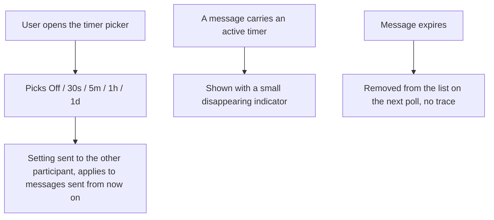

# Instruction: Web - timer picker, expiry indicator

## Architecture projection

> Tree of the final files. ✅ create · ✏️ modify · ❌ delete

```txt
.
└── web/
    └── src/
        ├── App.tsx                    ✏️
        └── screens/Conversation.tsx   ✏️
```

## User Journey



## Wireframe

```txt
┌─────────────────────────────────────┐
│ (1) Conversation      ⏱ [5m ▾]       │
├─────────────────────────────────────┤
│ (2)                    [Hi there!] ⏱ │
│                       sent (read)    │
│  [Hey, how are you?]                 │
│                                       │
│ (3)              [📎 photo.jpg 2.1MB]│
│                     (sending...)     │
├─────────────────────────────────────┤
│ (4) [ Type a message... ] [📎] [Send]│
└─────────────────────────────────────┘
```

1. Header, unchanged, plus a timer picker: Off / 30s / 5m / 1h / 1d.
2. A text bubble with an active timer shows a small ⏱ marker alongside its status - static marker, no live countdown.
3. File bubbles, unchanged (files don't carry a timer in this pass - text only, per the issue's scope).
4. Composer, unchanged.

## Tasks to do

### 1) Timer picker

> Wire the wireframe's new header control to `setDisappearingTimer`.

1. `App.tsx`: on `enterConversation`, read the contact's current timer via `getTimerSeconds` into state; add `handleSetTimer(seconds)` calling `setDisappearingTimer`
2. `screens/Conversation.tsx`: a `<select>` in the header with the five options, value from a `timerSeconds` prop, `onChange` calling a new `onSetTimer` prop

### 2) Expiry indicator

> Messages with an active timer are visibly distinct from permanent ones - static marker, not a countdown (a countdown would re-render every second for no behavior change; skip it, add if actually requested).

1. `screens/Conversation.tsx`: render a `⏱` marker (`data-testid="disappearing-marker"`) next to a text message's status when it has `timerSeconds` set

## Test acceptance criteria

| Task | Acceptance criteria              |
| ---- | -------------------------------- |
| 1 | Alice sets a 5-minute timer; Bob's picker reflects "5m" after his next poll |
| 1 | A message sent after the timer is set carries it; one sent before does not |
| 2 | A message sent while a timer is active shows the disappearing marker; one sent with the timer off does not |
