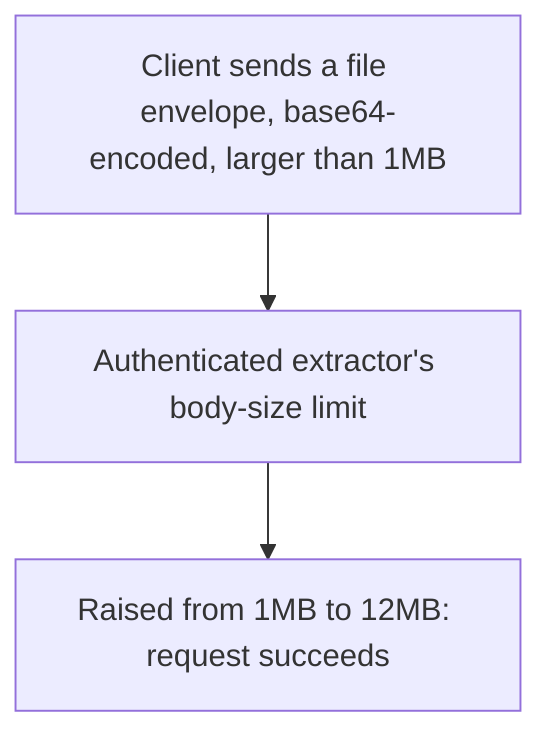

# Instruction: Server - raise the request body size limit

## Architecture projection

> Tree of the final files. ✅ create · ✏️ modify · ❌ delete

```txt
.
└── server/
    ├── src/auth.rs        ✏️
    └── tests/messages.rs  ✏️
```

## User Journey



## Tasks to do

### 1) Raise the body size limit

> Currently hardcoded to 1,000,000 bytes - too small for an 8MB file plus base64/envelope overhead.

1. `server/src/auth.rs`: change the `axum::body::to_bytes(body, 1_000_000)` limit to 12MB (`12 * 1024 * 1024`), as a named constant next to `MAX_CLOCK_SKEW_SECS`

## Test acceptance criteria

| Task | Acceptance criteria              |
| ---- | -------------------------------- |
| 1 | Sending a message with a ~10MB body succeeds (previously would have been rejected at 1MB); a body over 12MB is still rejected |
