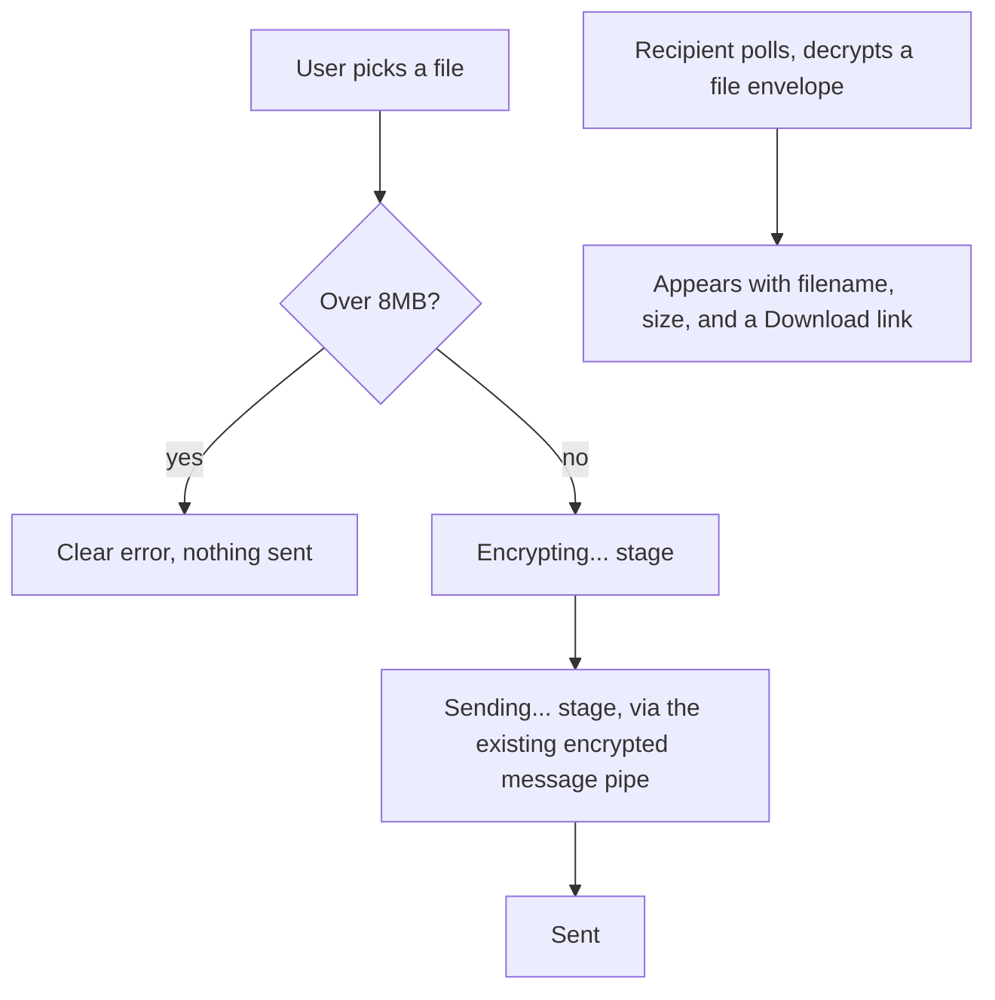

# Instruction: Web - file picker, encrypted send/receive, progress

## Architecture projection

> Tree of the final files. ✅ create · ✏️ modify · ❌ delete

```txt
.
└── web/
    └── src/
        ├── chat/conversation.ts       ✏️
        ├── storage/messageStore.ts    ✏️
        └── screens/Conversation.tsx   ✏️
```

## User Journey



## Wireframe

```txt
┌─────────────────────────────────────┐
│ (1) Conversation                     │
├─────────────────────────────────────┤
│ (2)                    [Hi there!]   │
│                       sent (read)    │
│  [Hey, how are you?]                 │
│                                       │
│ (3)              [📎 photo.jpg 2.1MB]│
│                     (sending...)     │
│  [📎 report.pdf 500KB]  [Download]   │
│                                       │
├─────────────────────────────────────┤
│ (4) [ Type a message... ] [📎] [Send]│
└─────────────────────────────────────┘
```

1. Header, unchanged.
2. Existing text message bubbles, unchanged.
3. File message bubbles: filename and human-readable size always shown; a sent file shows its stage (encrypting/sending/sent) in place of the usual status; a received file shows a Download link instead.
4. Composer: text input plus a native file-picker button, alongside the existing Send button.

## Tasks to do

### 1) File envelope and size validation

> A new envelope type on the same encrypted pipe; reject oversized files before any encryption happens.

1. `chat/conversation.ts`: add a `FileEnvelope` type (`{ type: "file", id, filename, mimeType, size, data: number[] }`) alongside the existing `TextEnvelope`/`ReceiptEnvelope`
2. A `sendFile(contactId, file, account, store, onStageChange)` function: reject client-side (no network call) if `file.size` exceeds 8MB; otherwise read via `file.arrayBuffer()`, base64-decode-free (keep as raw bytes/array), build the envelope, encrypt, send through the existing `sendMessage`, reporting `"encrypting" → "sending" → "sent"` via `onStageChange`
3. In `poll()`: handle `envelope.type === "file"` by decoding the file bytes and appending a received file message to history

### 2) Persist file messages

> Local history needs to hold file bytes too, not just text.

1. `storage/messageStore.ts`: extend `ChatMessage` with an optional `file: { filename: string; mimeType: string; size: number; bytes: Uint8Array }` field (IndexedDB stores `Uint8Array` natively via structured clone, no extra encoding needed)

### 3) Conversation screen: file picker, file bubbles, download

> Wire the wireframe's new elements to the send/receive flow.

1. `screens/Conversation.tsx`: a native `<input type="file">` (a button styled over it, or a visible file input - simplest first) next to the composer; on selection, call `sendFile` and show its stage until "sent"
2. Render a file message differently from a text message: filename + human-readable size always; a sent file's stage in place of its status; a received file as a `Download` link built from `URL.createObjectURL(new Blob([bytes]))`
3. Client-side size check: if the picked file exceeds 8MB, show an inline error immediately, do not call `sendFile` at all

## Test acceptance criteria

| Task | Acceptance criteria              |
| ---- | -------------------------------- |
| 1, 2, 3 | Two independent app instances: sending a file from one is decrypted and downloadable from the other, byte-for-byte identical to the original |
| 3 | Picking a file over 8MB shows a clear error immediately, with no request ever sent |
| 1 | The sender sees the stage progress (not stuck on one static label) while a file sends |
