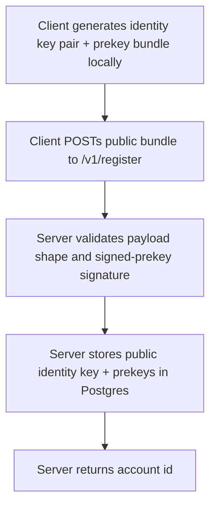

# Instruction: Server registration API + schema

## Architecture projection

> Tree of the final files. ✅ create · ✏️ modify · ❌ delete

```txt
.
├── server/
│   ├── Cargo.toml                     ✅
│   ├── migrations/
│   │   └── 0001_create_identities.sql ✅
│   └── src/
│       ├── main.rs                    ✅
│       ├── db.rs                      ✅
│       └── routes/
│           ├── mod.rs                 ✅
│           └── register.rs            ✅
```

## User Journey



## Tasks to do

### 1) Scaffold the Rust server crate

> Get an Axum server running with a Postgres connection pool.

1. `cargo new server --bin`, add `axum`, `tokio`, `sqlx` (postgres, runtime-tokio), `serde`, `serde_json` to `Cargo.toml`
2. Add `libsignal-protocol` as a git dependency pinned to tag `v0.99.1` from `https://github.com/signalapp/libsignal` (the server only needs it to verify the shape/signature of uploaded public key material, never to hold a private key)
3. Wire a Postgres connection pool from `DATABASE_URL` at startup

### 2) Add the identities schema

> Store public key material only, nothing private.

1. Write migration `0001_create_identities.sql`: `accounts` (id, created_at), `identity_keys` (account_id, public_key bytes, registration_id), `prekeys` (account_id, key_id, public_key bytes, used boolean), `signed_prekey` (account_id, key_id, public_key bytes, signature)
2. Run the migration against the local Postgres instance

### 3) Implement `POST /v1/register`

> Accept a public identity key + prekey bundle, reject anything shaped like a private key.

1. Define the request DTO: identity public key, registration id, signed prekey (id, public key, signature), one-time prekeys (id, public key list)
2. Validate the signed prekey's signature against the identity public key using `libsignal-protocol`'s verification function, reject on failure
3. Insert the account and its public key material in one transaction
4. Return the created account id

## Test acceptance criteria

| Task | Acceptance criteria              |
| ---- | -------------------------------- |
| 1 | `cargo run` starts the server and it connects to Postgres without error |
| 2 | The migration runs cleanly against a fresh database; no column stores anything named or shaped like a private key |
| 3 | POSTing a valid bundle returns 201 with an account id; POSTing a bundle with an invalid signed-prekey signature returns a 4xx and nothing is persisted |
