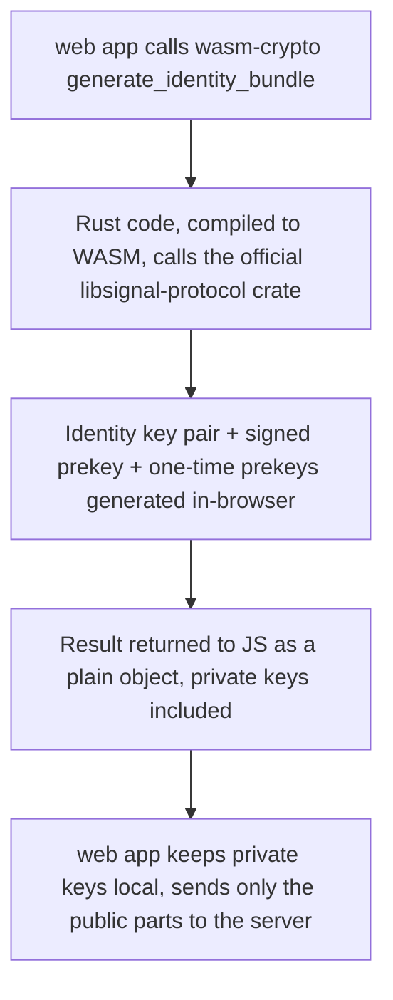

# Instruction: WASM crypto wrapper around official libsignal-protocol

## Architecture projection

> Tree of the final files. ✅ create · ✏️ modify · ❌ delete

```txt
.
├── wasm-crypto/
│   ├── Cargo.toml    ✅
│   └── src/
│       └── lib.rs    ✅
```

## User Journey



## Tasks to do

### 1) Scaffold the WASM crate

> A `cdylib` crate depending on the same official, tag-pinned `libsignal-protocol` the server uses.

1. `cargo new wasm-crypto --lib`, set `crate-type = ["cdylib"]` in `Cargo.toml`
2. Add `wasm-bindgen` and `libsignal-protocol` as a git dependency pinned to tag `v0.99.1` from `https://github.com/signalapp/libsignal` (same tag as `server/`, so both sides speak the same protocol version)
3. Install the `wasm32-unknown-unknown` target and `wasm-pack` if not already present

### 2) Expose identity + prekey bundle generation

> One function, callable from JS, that does everything phase-3's client needs.

1. `lib.rs`: a `#[wasm_bindgen]` function that generates an identity key pair, a registration id, one signed prekey, and a batch of one-time prekeys via `libsignal-protocol`
2. Handle the browser-randomness gotcha: `getrandom`/`rand`'s default OS entropy source does not exist in a browser sandbox, so the crate needs the WASM-targeted randomness feature enabled — resolve the exact feature flag against the real compiler error, don't guess it upfront
3. Return the result to JS as a plain serializable object (public and private key bytes, key ids), leaving what to persist where as phase-3's job

### 3) Build and smoke-test the WASM package

> Prove it actually runs in a JS environment, not just that `cargo build` succeeds for the native target.

1. `wasm-pack build --target web`
2. Load the built package from a plain Node or browser-like JS snippet and call the generation function, confirming it returns key bytes without throwing

## Test acceptance criteria

| Task | Acceptance criteria              |
| ---- | -------------------------------- |
| 1 | `cargo build --target wasm32-unknown-unknown` succeeds inside `wasm-crypto/` |
| 2 | `wasm-pack build --target web` succeeds and emits a `pkg/` directory |
| 3 | A JS snippet importing the built package and calling the generation function returns a non-empty identity public key, signed prekey (with signature), and at least one one-time prekey, with no thrown error |
