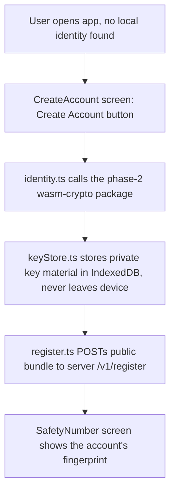

# Instruction: Web client identity generation + registration UI

## Architecture projection

> Tree of the final files. ✅ create · ✏️ modify · ❌ delete

```txt
.
├── web/
│   ├── package.json                    ✅
│   ├── src/
│   │   ├── main.tsx                    ✅
│   │   ├── crypto/
│   │   │   └── identity.ts             ✅
│   │   ├── storage/
│   │   │   └── keyStore.ts             ✅
│   │   ├── api/
│   │   │   └── register.ts             ✅
│   │   └── screens/
│   │       ├── CreateAccount.tsx       ✅
│   │       └── SafetyNumber.tsx        ✅
```

## User Journey



## Wireframe

```txt
┌─────────────────────────────────────┐
│ (1) UmbraChat                        │
│                                       │
│         (2) [ Create Account ]       │
│                                       │
│   (3) No password. Your keys never   │
│       leave this device.             │
└─────────────────────────────────────┘

┌─────────────────────────────────────┐
│ (4) Your Safety Number                │
│                                       │
│  (5) 12345 67890 12345 67890         │
│      12345 67890 12345 67890         │
│                                       │
│  (6) Share this number with contacts │
│      to verify your identity.        │
│         [ Continue ]                 │
└─────────────────────────────────────┘
```

1. Brand header, no account/menu since there's no login yet.
2. Single call-to-action, no form fields — the identity is generated, not entered.
3. Sets expectation: no password, keys stay local.
4. Header for the post-creation safety-number screen.
5. The generated fingerprint, formatted in grouped digits (matches how Signal displays safety numbers).
6. Explains the number's purpose and lets the user proceed into the app.

## Tasks to do

### 1) Wire the phase-2 WASM package into the web app

> Get a React + Vite app running with the locally-built `wasm-crypto` package available.

1. `npm create vite@latest web -- --template react-ts` (if not already scaffolded)
2. Add the `wasm-crypto/pkg` output from phase 2 as a local dependency (file/path reference, not an npm registry package)
3. Confirm it loads in the browser without a bundler error

### 2) Generate and store the identity locally

> On first launch, generate the identity key pair and prekey bundle, keep the private material on-device.

1. `crypto/identity.ts`: call the `wasm-crypto` package's generation function to get an identity key pair, registration id, signed prekey, and one-time prekeys
2. `storage/keyStore.ts`: persist the private identity key and prekey private material in IndexedDB; never send it anywhere
3. On subsequent launches, detect an existing local identity and skip generation

### 3) Build the Create Account and Safety Number screens

> Wire the two screens from the wireframe to the generation + registration flow.

1. `screens/CreateAccount.tsx`: single button, calls `identity.ts` then `api/register.ts`
2. `api/register.ts`: POST the public bundle (identity public key, registration id, signed prekey + signature, one-time prekeys) to `/v1/register`, store the returned account id locally
3. `screens/SafetyNumber.tsx`: derive and display the safety number from the local identity public key, formatted in grouped digits

## Test acceptance criteria

| Task | Acceptance criteria              |
| ---- | -------------------------------- |
| 1 | `npm run dev` serves the app and the `wasm-crypto` module initializes with no console error |
| 2 | Reloading the app after account creation does not regenerate a new identity (the existing one is reused) |
| 3 | Clicking "Create Account" leads to a Safety Number screen showing a non-empty fingerprint, and the server's `identity_keys` table has exactly one new row containing only public key bytes |
