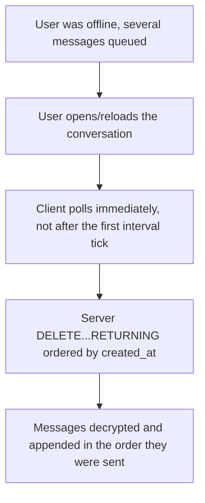

# Instruction: Ordered, immediate delivery on reconnect

## Architecture projection

> Tree of the final files. ✅ create · ✏️ modify · ❌ delete

```txt
.
├── server/
│   ├── src/routes/messages.rs   ✏️
│   └── tests/messages.rs        ✏️
└── web/
    └── src/App.tsx               ✏️
```

## User Journey



## Tasks to do

### 1) Order delivery by send time

> `DELETE ... RETURNING` has no defined row order.

1. `server/src/routes/messages.rs`: Postgres's `DELETE` doesn't support `ORDER BY` at all (verified against a real instance - syntax error), so sort the returned rows by `created_at` in Rust after the fetch, before building the response
2. Note in a comment: this orders by server receipt time, not client send time; acceptable at this scale, revisit if clock skew or out-of-order network delivery ever becomes a real problem

### 2) Poll immediately on reconnect, not after the first interval tick

> `window.setInterval` only fires after the full interval elapses - a 3s delay before offline-queued messages appear.

1. `web/src/App.tsx`, in `enterConversation`: call `poll()` once immediately before starting the interval

## Test acceptance criteria

| Task | Acceptance criteria              |
| ---- | -------------------------------- |
| 1 | Sending 3 messages in immediate succession to an offline recipient, then fetching once they reconnect, returns them in the order they were sent |
| 2 | Opening a conversation with pending messages shows them without waiting for a poll interval to elapse |
