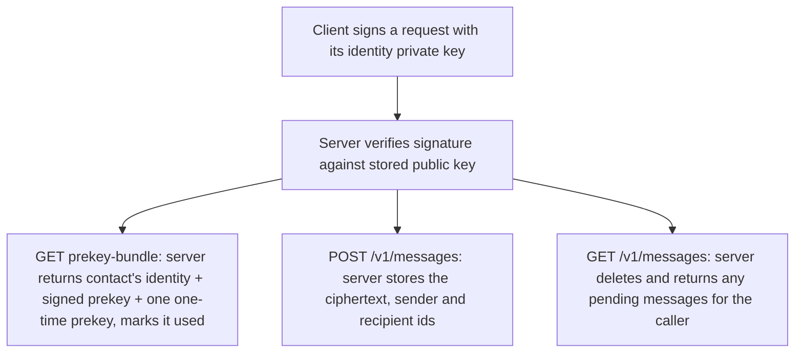

# Instruction: Server authenticated messaging API

## Architecture projection

> Tree of the final files. ✅ create · ✏️ modify · ❌ delete

```txt
.
├── server/
│   ├── migrations/
│   │   └── 0002_create_messages.sql   ✅
│   └── src/
│       ├── auth.rs                    ✅
│       └── routes/
│           ├── mod.rs                 ✏️
│           ├── prekey_bundle.rs       ✅
│           └── messages.rs            ✅
```

## User Journey



## Tasks to do

### 1) Add the messages schema

> Minimal columns: no delivery/read status server-side — those travel as more encrypted messages.

1. Write migration `0002_create_messages.sql`: `messages` (id, sender_account_id, recipient_account_id, ciphertext bytea, created_at)

### 2) Implement signature auth

> Every authenticated request proves account ownership via the identity key from issue #1 — no sessions, no tokens.

1. `auth.rs`: an Axum extractor reading `X-Account-Id`, `X-Timestamp`, `X-Signature` headers
2. Reject a timestamp older than a few minutes (replay protection)
3. Look up the claimed account's stored identity public key, reconstruct the signed payload (method + path + timestamp + a hash of the body), and verify via the same `PublicKey::verify_signature` already used for prekey verification
4. Reject with 401 on any failure (unknown account, bad signature, stale timestamp)

### 3) Implement `GET /v1/accounts/:id/prekey-bundle`

> Lets a client start an X3DH session with a contact.

1. Require auth (any authenticated account may fetch another's bundle — that's the point of the endpoint)
2. Return the target account's identity public key and signed prekey
3. Atomically claim one unused one-time prekey (`UPDATE ... SET used = true WHERE account_id = $1 AND used = false LIMIT 1 RETURNING ...`) and include it if one was available; the bundle is still valid without one, just with slightly weaker forward secrecy for that session, per the X3DH spec

### 4) Implement `POST /v1/messages`

> Store an encrypted envelope for later pickup.

1. Require auth; the sender is the authenticated caller, never a client-supplied field
2. Body: `recipient_account_id`, `ciphertext` (base64)
3. Insert one row

### 5) Implement `GET /v1/messages`

> Fetch-and-remove: hand back everything waiting for the caller, then delete it.

1. Require auth
2. `DELETE FROM messages WHERE recipient_account_id = $caller RETURNING sender_account_id, ciphertext, created_at`
3. Return the list (may be empty)

## Test acceptance criteria

| Task | Acceptance criteria              |
| ---- | -------------------------------- |
| 1 | Migration runs cleanly; the `messages` table has no delivered/read status columns |
| 2 | A request with a valid signature succeeds; a tampered signature or a stale timestamp returns 401 |
| 3 | Fetching a bundle returns the identity key, signed prekey, and at most one one-time prekey; fetching again for the same account never returns the same one-time prekey twice |
| 4, 5 | Sending a message then fetching returns it exactly once; a second fetch immediately after returns nothing |
