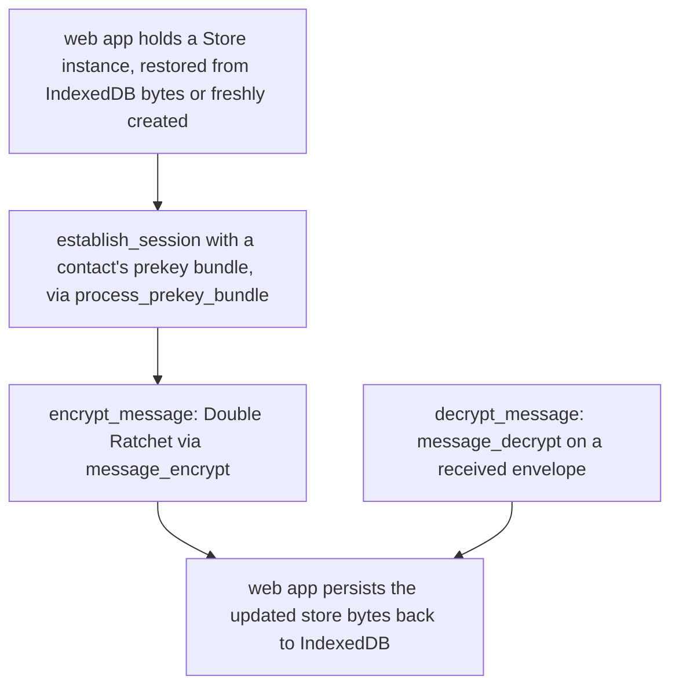

# Instruction: wasm-crypto stateful sessions, encrypt/decrypt

## Architecture projection

> Tree of the final files. ✅ create · ✏️ modify · ❌ delete

```txt
.
├── wasm-crypto/
│   └── src/
│       ├── lib.rs       ✏️
│       └── session.rs   ✅
```

## User Journey



## Tasks to do

### 1) Make the store stateful and exportable

> Move from phase 1-2's one-shot generation calls to a session store a JS caller holds across many calls.

1. `session.rs`: a `#[wasm_bindgen]` struct wrapping `InMemSignalProtocolStore` (or its constituent `InMem*Store` pieces), constructible from an existing identity key pair (from phase 1's `generate_identity_bundle`)
2. An export function serializing every held record (identity, signed prekey, remaining one-time prekeys, any established sessions) via each record's own wire `.serialize()` — not a direct struct dump, since the in-memory stores don't derive `Serialize`
3. An import function reconstructing an equivalent store from previously exported bytes

### 2) Session establishment

> X3DH: turn a contact's prekey bundle into a session.

1. A function taking the store and a contact's prekey bundle (identity key, signed prekey + signature, optional one-time prekey), calling `process_prekey_bundle`
2. Skip re-establishing if a session with that contact already exists in the store

### 3) Encrypt and decrypt

> Double Ratchet, via the now-established session.

1. An encrypt function: store + recipient identifier + plaintext bytes → ciphertext, via `message_encrypt`
2. A decrypt function: store + sender identifier + ciphertext → plaintext bytes. Determine against the real API (not guessed here) whether the first message in a session needs `message_decrypt_prekey` versus subsequent ones needing `message_decrypt`, and dispatch correctly

## Test acceptance criteria

| Task | Acceptance criteria              |
| ---- | -------------------------------- |
| 1 | A store can be exported to bytes and a new store reconstructed from those bytes behaves identically (round-trips) |
| 2, 3 | Given two independently generated identities and a prekey bundle from one, the other establishes a session and encrypts a message that the first correctly decrypts back to the original plaintext |
| 3 | A second message sent in the same already-established session also encrypts and decrypts correctly, proving the ratchet advances rather than only the very first message working |
