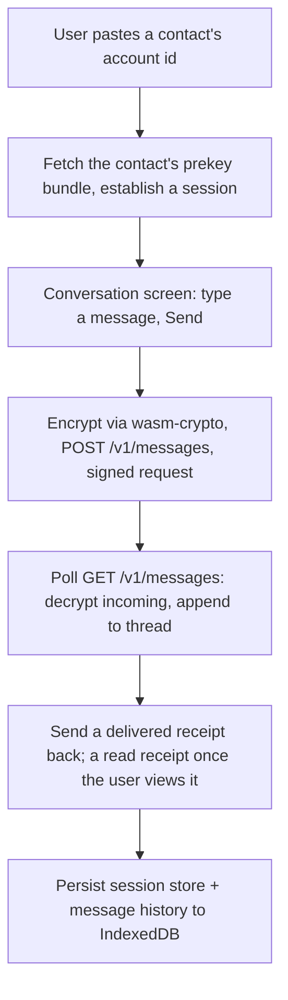

# Instruction: Web client chat UI

## Architecture projection

> Tree of the final files. ✅ create · ✏️ modify · ❌ delete

```txt
.
├── web/
│   └── src/
│       ├── crypto/
│       │   └── session.ts          ✅
│       ├── storage/
│       │   ├── keyStore.ts         ✏️
│       │   └── messageStore.ts     ✅
│       ├── api/
│       │   ├── signedRequest.ts    ✅
│       │   ├── prekeyBundle.ts     ✅
│       │   └── messages.ts         ✅
│       ├── screens/
│       │   ├── NewConversation.tsx ✅
│       │   └── Conversation.tsx    ✅
│       └── App.tsx                 ✏️
```

## User Journey



## Wireframe

```txt
┌─────────────────────────────────────┐
│ (1) UmbraChat                        │
│                                       │
│  (2) [ Recipient account id______ ]  │
│         [ Start Conversation ]       │
└─────────────────────────────────────┘

┌─────────────────────────────────────┐
│ (3) Conversation                     │
├─────────────────────────────────────┤
│ (4)                    [Hi there!]   │
│                       sent ✓✓ read   │
│  [Hey, how are you?]                 │
│                                       │
├─────────────────────────────────────┤
│ (5) [ Type a message...     ] [Send] │
└─────────────────────────────────────┘
```

1. Reused brand header.
2. No contacts list exists yet as a feature — pasting the recipient's account id (from issue #1's registration response) is the minimal way to identify who to message for this story's scope.
3. Header for the active conversation.
4. Message thread: own messages right-aligned with a sent/delivered/read status line; incoming messages left-aligned.
5. Composer: text input plus send button.

## Tasks to do

### 1) Signed request helper

> Every authenticated call needs the same signing shape; write it once.

1. `api/signedRequest.ts`: signs method + path + timestamp + a hash of the body with the local identity private key, attaches `X-Account-Id`/`X-Timestamp`/`X-Signature` headers
2. `api/prekeyBundle.ts` and `api/messages.ts` both use it

### 2) New Conversation screen

> Paste a contact's account id, establish a session with them.

1. `screens/NewConversation.tsx`: an input for the recipient's account id and a start button
2. On submit: fetch the contact's prekey bundle (`api/prekeyBundle.ts`), establish a session via `crypto/session.ts` (phase 2's wrapper) if one doesn't already exist, navigate to the conversation

### 3) Conversation screen

> The actual message thread.

1. `screens/Conversation.tsx`: message list plus composer, wired to the wireframe
2. Sending: encrypt via `crypto/session.ts`, `POST /v1/messages`, show the message as "sent" immediately
3. Receiving: poll `GET /v1/messages` on load and on an interval; decrypt each envelope; distinguish a real text message from a delivered/read receipt by a small JSON envelope encrypted as the message body (e.g. `{ type: "text" | "delivered" | "read", body }`)
4. On receiving a text message: append it to the thread and send back a "delivered" receipt; on the recipient actually viewing it, send a "read" receipt
5. On receiving a receipt for one of the user's own sent messages: update that message's status line

### 4) Persist session and message state

> Survive a reload without losing the conversation or re-establishing the session.

1. `storage/keyStore.ts`: extend to also persist the phase-2 session store's exported bytes
2. `storage/messageStore.ts`: persist decrypted message history locally (plaintext, since it's the user's own device) for display across reloads

## Test acceptance criteria

| Task | Acceptance criteria              |
| ---- | -------------------------------- |
| 1, 2, 3 | Two independent app instances (two browser contexts) can exchange a text message end to end — a real two-page browser test, not a unit-level mock |
| 3 | A sent message shows "sent" immediately, then "delivered" once the recipient's client has fetched it, without the sender needing to manually refresh |
| 4 | Reloading either app preserves the session (no re-establishing X3DH) and the message history |
