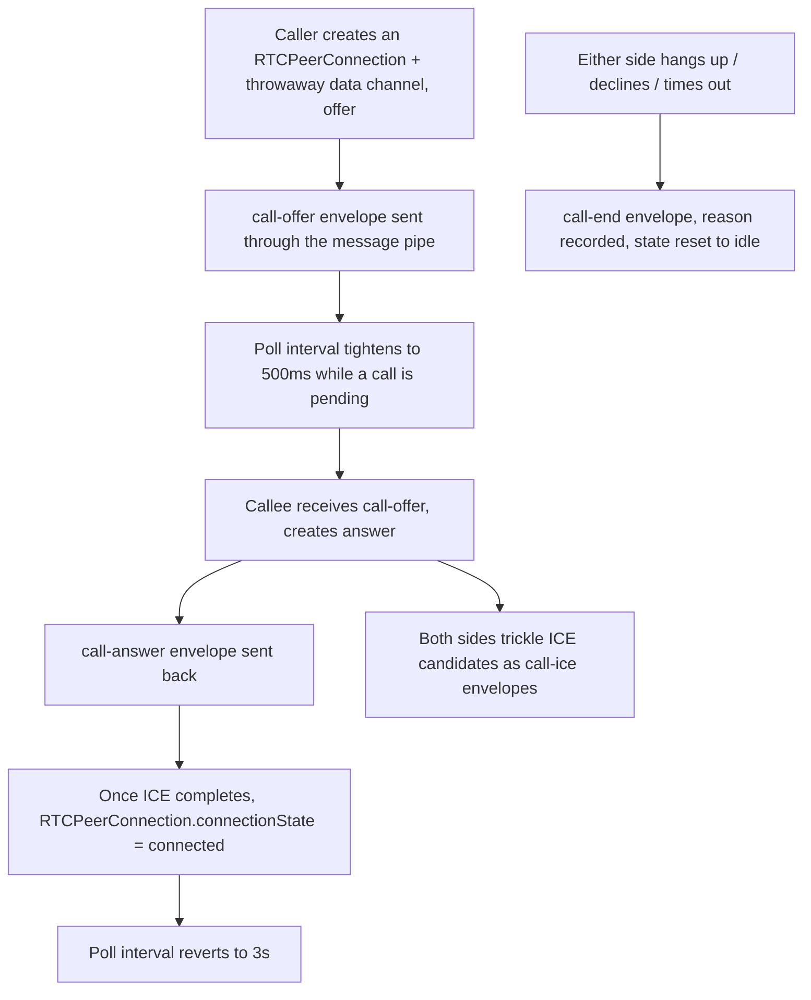

# Instruction: Signaling envelopes and call state machine

## Architecture projection

> Tree of the final files. ✅ create · ✏️ modify · ❌ delete

```txt
.
└── web/
    └── src/
        └── chat/
            ├── conversation.ts   ✏️
            └── call.ts           ✅
```

## User Journey



## Tasks to do

### 1) Signaling envelope types

> Control envelopes, same family as the existing timer envelope - never shown as chat messages.

1. `chat/conversation.ts`: add `CallOfferEnvelope { type: "call-offer", callId, kind: "voice" | "video", sdp }`, `CallAnswerEnvelope { type: "call-answer", callId, sdp }`, `CallIceEnvelope { type: "call-ice", callId, candidate }` (a serialized `RTCIceCandidateInit`), `CallEndEnvelope { type: "call-end", callId, reason: "hangup" | "declined" | "cancelled" | "timeout" | "failed" }` to the `Envelope` union
2. `poll()`: route each `call-*` envelope type to a callback the caller supplies (e.g. `onCallSignal(envelope)`) instead of pushing to chat history - mirrors how `timer` envelopes are handled today, just parameterized since call.ts owns the reaction, not conversation.ts

### 2) Call state machine

> One `callId` per attempt; state lives in `call.ts`, independent of chat history.

1. `chat/call.ts` (new): a `CallState` union - `idle | { status: "outgoing-ringing" | "incoming-ringing" | "connecting" | "connected"; callId; kind }| { status: "ended"; reason }`
2. `startCall(contactId, kind, account, store)`: generates a `callId`, creates an `RTCPeerConnection` (STUN-only `iceServers`, configurable), opens a throwaway `RTCDataChannel` purely to give `createOffer()` valid media-less SDP to negotiate over, sends the `call-offer` envelope, moves state to `outgoing-ringing`
3. `handleIncomingOffer`, `acceptCall`, `declineCall`, `hangUp`, `handleAnswer`, `handleIceCandidate`: wire the rest of the state machine and the RTCPeerConnection's `onicecandidate`/`onconnectionstatechange` to the envelope exchange and state transitions
4. A 30s no-answer timeout on `outgoing-ringing`: if no `call-answer` arrives, send `call-end` (`reason: "timeout"`) and move to `ended`

### 3) Tighten polling during a call attempt

> Ringing and ICE exchange need faster round trips than the 3s message-poll interval; connected calls don't poll for signaling at all (the data channel/media path is already live).

1. Expose the current `CallState` so the poll loop (in `App.tsx`, phase 3) can react to it - out of scope here beyond returning the state; the interval change itself is a phase-3 wiring task

### 4) Minimal App.tsx wiring, for real end-to-end testability

> Amendment made during implementation: phase 1's own acceptance criteria needs two live browser instances actually completing a signaling exchange, which is impossible to verify through the real app without at least routing signals and having *some* way to trigger a call - can't be deferred to phase 3 like the polished UI can.

1. `App.tsx`: pass `handleCallSignal` as `poll()`'s new `onCallSignal` argument, unconditionally (no interval change yet - that part is still phase 3)
2. Bare, temporary trigger controls (a couple of buttons + a raw `CallState` readout) directly in `App.tsx`'s conversation view - not the polished banner/active-call screen, which is phase 3's job and will replace this outright

## Test acceptance criteria

| Task | Acceptance criteria              |
| ---- | -------------------------------- |
| 1, 2 | Two independent app instances: `startCall` on one side and `acceptCall` on the other results in both `RTCPeerConnection`s reaching `connectionState === "connected"` - verified for real, not mocked, using a throwaway data channel (no camera/mic needed yet) |
| 2 | Declining an incoming call moves the caller's state to `ended` with `reason: "declined"` |
| 2 | An offer that gets no answer within 30s moves the caller's state to `ended` with `reason: "timeout"` |
