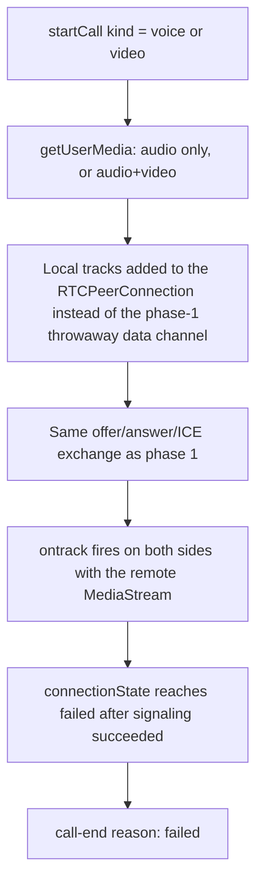

# Instruction: WebRTC wiring - real audio/video between two peers

## Architecture projection

> Tree of the final files. ✅ create · ✏️ modify · ❌ delete

```txt
.
└── web/
    └── src/
        └── chat/
            └── call.ts   ✏️
```

## User Journey



## Tasks to do

### 1) Real media instead of the throwaway data channel

> Swap phase 1's placeholder for actual audio/video tracks.

1. `chat/call.ts::startCall` / `acceptCall`: call `getUserMedia({ audio: true, video: kind === "video" })` before creating the offer/answer; add the resulting tracks to the `RTCPeerConnection`, drop the phase-1 data channel
2. Expose the local `MediaStream` and, once `ontrack` fires, the remote `MediaStream` from `call.ts`'s state so phase 3's UI can attach them to `<audio>`/`<video>` elements
3. `hangUp` and any call-ending path: stop all local tracks (`track.stop()`) - releasing the camera/mic is not optional, leaving it on after a call ends is a real privacy bug in an app built specifically to resist surveillance

### 2) Surface connection failure

> ICE can still fail after signaling succeeds (the NAT-blocked case from the issue's acceptance criteria) - direct P2P has no TURN fallback to fall back to.

1. `chat/call.ts`: on `RTCPeerConnection.onconnectionstatechange`, if the state reaches `"failed"`, send `call-end` (`reason: "failed"`) and move state to `ended`

## Test acceptance criteria

| Task | Acceptance criteria              |
| ---- | -------------------------------- |
| 1 | Two independent app instances, fake media devices: a video call results in each side's remote `MediaStream` actually containing a live video track from the other side, not just a successful connection state |
| 1 | A voice-only call's remote stream has an audio track and no video track |
| 1 | After `hangUp`, the local `MediaStream`'s tracks are all in `"ended"` readyState - the camera/mic indicator would turn off |
