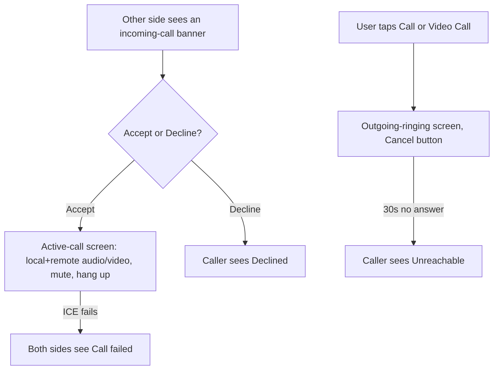

# Instruction: Web - call controls, incoming-call banner, active-call screen

## Architecture projection

> Tree of the final files. ✅ create · ✏️ modify · ❌ delete

```txt
.
└── web/
    └── src/
        ├── App.tsx                    ✏️
        └── screens/
            ├── Conversation.tsx       ✏️
            └── CallScreen.tsx         ✅
```

## User Journey



## Wireframe

```txt
┌─────────────────────────────────────┐
│ (1) Conversation      ⏱ [5m ▾] 📞 🎥 │
├─────────────────────────────────────┤
│ (2)                    [Hi there!] ⏱ │
│                       sent (read)    │
├─────────────────────────────────────┤
│ (3) [ Type a message... ] [📎] [Send]│
└─────────────────────────────────────┘

Incoming call banner (overlays the conversation):
┌─────────────────────────────────────┐
│ (4) Incoming video call   [Decline] [Accept] │
└─────────────────────────────────────┘

Active call screen:
┌─────────────────────────────────────┐
│ (5)         [ remote video/avatar ]  │
│                                       │
│              [local preview]  (6)    │
│                                       │
│ (7)        [Mute]  [Hang up]         │
└─────────────────────────────────────┘
```

1. Header gains two buttons: voice call (📞) and video call (🎥), disabled while any call is already active.
2. Existing message list, unchanged.
3. Composer, unchanged.
4. Incoming-call banner: shown whenever state is `incoming-ringing`, names the call kind, Accept/Decline.
5. Active-call screen: remote stream in a `<video>` (video calls) or just remote `<audio autoPlay>` with no visible element (voice calls) - state label (`connecting...`, `Declined`, `Unreachable`, `Call failed`) shown instead of the remote pane when not connected.
6. Local preview: small self-view for video calls only; omitted for voice.
7. Controls: mute toggle (disables the local audio track, doesn't stop it - unmuting must not require re-requesting `getUserMedia`), hang up (also cancels an outgoing ring or declines an incoming one, depending on state).

## Tasks to do

### 1) Call buttons and state wiring

1. `App.tsx`: hold `CallState` from `chat/call.ts`; wire the poll loop to switch to the 500ms interval while `outgoing-ringing | incoming-ringing`, back to 3s otherwise (the phase-1 groundwork this was deferred to)
2. `screens/Conversation.tsx`: two header buttons calling `onStartCall("voice" | "video")`, disabled unless `CallState` is idle/ended

### 2) Incoming-call banner and active-call screen

1. `screens/CallScreen.tsx` (new): renders the banner for `incoming-ringing`, and the full active-call layout for every other non-idle state, per the wireframe
2. Attach local/remote `MediaStream`s to `<video>`/`<audio>` elements via `srcObject` (not `src` - streams aren't URLs)
3. Mute: toggle `track.enabled` on the local audio track, not `track.stop()` - stopping would require a fresh `getUserMedia` prompt to unmute
4. End states (`declined`, `timeout`, `failed`, `hangup`, `cancelled`) each render a distinct, plain-language label, then return to idle after a short delay or on dismiss

## Test acceptance criteria

| Task | Acceptance criteria              |
| ---- | -------------------------------- |
| 1, 2 | Two independent app instances, fake media devices: A calls B, B accepts, both see the active-call screen with live remote video |
| 1, 2 | B declines: A sees a distinct "Declined" state, not a silent hang or a generic error |
| 2 | A voice call never renders a remote `<video>` element with a real stream attached - audio only |
| 1 | The poll interval measurably tightens during ringing (an incoming offer appears well under 3s) |
