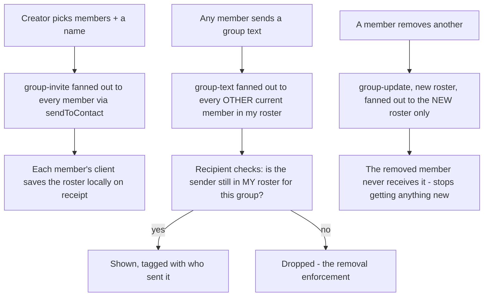

# Instruction: Group envelopes, local roster, fan-out send/receive

## Architecture projection

> Tree of the final files. ✅ create · ✏️ modify · ❌ delete

```txt
.
└── web/
    └── src/
        ├── chat/
        │   ├── conversation.ts   ✏️
        │   └── group.ts          ✅
        └── storage/
            ├── groupStore.ts     ✅
            └── messageStore.ts   ✏️
```

## User Journey



## Tasks to do

### 1) Group envelope types, exported for reuse

1. `chat/conversation.ts`: add `GroupInviteEnvelope { type: "group-invite", groupId, name, memberAccountIds: string[] }`, `GroupUpdateEnvelope { type: "group-update", groupId, memberAccountIds: string[] }`, `GroupTextEnvelope { type: "group-text", groupId, id, body }` to the `Envelope` union; export a `GroupEnvelope` union and `isGroupEnvelope` predicate (mirrors `CallEnvelope`/`isCallEnvelope`)
2. `chat/conversation.ts`: export the existing private `sendToContact` - `chat/group.ts` reuses it directly for per-member fan-out rather than reimplementing per-device session/establish/encrypt/send/persist logic

### 2) `poll()` decrypts before filtering by sender

> A group message can arrive from *any* member, not just "the contact this conversation happens to be open with" - the existing sender-mismatch drop-filter runs before decryption today, which would silently drop every group message whose sender isn't the one 1:1 contact currently open.

1. `chat/conversation.ts::poll`: decrypt every received message first, regardless of sender, *then* branch: a group envelope always routes to a new `onGroupSignal?: (envelope: GroupEnvelope, senderAccountId: string) => Promise<void>` callback (added alongside the existing `onCallSignal`); anything else keeps today's sender-must-match-`contactId` drop-filter before further handling. Side effect worth noting, not the point of this change: this also fixes a latent bug where a message from a sender other than the open contact was never decrypted at all, permanently desyncing that sender's local ratchet from the version they hold - see the existing "gone the moment we see it here" ponytail comment this touches

### 3) Local roster storage

1. `storage/groupStore.ts` (new): `Group { id: string; name: string; memberAccountIds: string[]; createdAt: string }`; `loadGroup(groupId)`, `saveGroup(group)`, `loadAllGroups()` (IndexedDB, same shape as `messageStore.ts`)
2. `storage/messageStore.ts`: add optional `senderAccountId?: string` to `ChatMessage` - only populated for *received* group messages, to say which member sent it (a 1:1 conversation's sender is already implicit from context)

### 4) `chat/group.ts`: create, send, receive, remove

> Amendment made during implementation: a member-relative roster (`memberAccountIds` meaning "everyone except me") can't be broadcast unchanged - what it excludes is different for every recipient. The envelope's `memberAccountIds` is the *full* roster, including the sender; every recipient stores that exact array unmodified, and only filters out their own account at fan-out time.

1. `createGroup(name, otherMemberAccountIds, account, store)`: generates a `groupId`, builds the full roster (`[account.accountId, ...otherMemberAccountIds]`), saves it locally, fans out a `group-invite` carrying that full roster to every other member via `sendToContact`
2. `sendGroupText(groupId, text, account, store)`: loads the local (full) roster, fans out a `group-text` to every member except the caller, saves the caller's own sent copy locally
3. `removeMember(groupId, memberAccountId, account, store)`: computes the new full roster with that member filtered out, saves it locally, fans out `group-update` carrying the new roster to every remaining member except the caller - the removed member is never sent it
4. `handleGroupSignal(envelope, senderAccountId)` (the `onGroupSignal` callback, purely reactive - never sends, doesn't need account/store): `group-invite` saves a new local group with the envelope's full roster as-is; `group-update` overwrites the local roster **only if the sender is already a member of the group's *current* local roster** (the actual authorization check - without it, anyone who ever learns a `groupId`, including an already-removed member, could rewrite a recipient's view of who's in it); `group-text` is appended to that group's local history *only if* `senderAccountId` is still present in the local roster for that `groupId` - the removal-enforcement check

## Test acceptance criteria

| Task | Acceptance criteria              |
| ---- | -------------------------------- |
| 4 | Creating a group with 2 other members and sending a text: both members receive and can decrypt it |
| 4 | Removing a member: a text sent afterward reaches only the remaining members, not the removed one |
| 4 | A `group-text` claiming to be from a member who was already removed (per the recipient's own roster) is dropped, not shown - verified by directly crafting and sending that envelope, not relying on the removed member's own client to behave |
| 2 | A message from someone other than the currently-open 1:1 contact, but tagged as a group envelope, is still processed (not dropped by the old sender-mismatch filter) |
