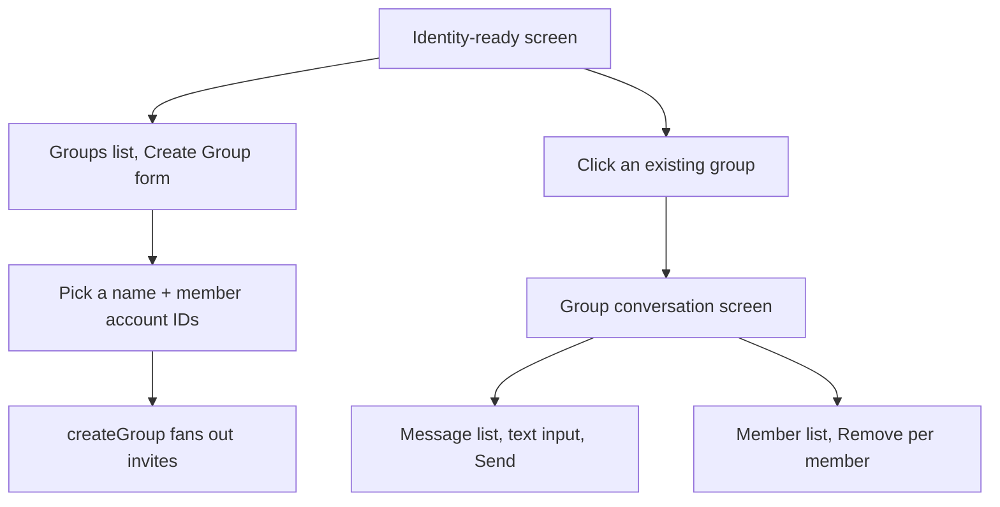

# Instruction: Web - create-group flow, group conversation screen, remove member

## Architecture projection

> Tree of the final files. ✅ create · ✏️ modify · ❌ delete

```txt
.
└── web/
    └── src/
        ├── App.tsx                    ✏️
        └── screens/
            ├── Groups.tsx             ✅
            └── GroupConversation.tsx  ✅
```

## User Journey



## Wireframe

```txt
Identity-ready screen, new section:
┌─────────────────────────────────────┐
│ (1) Groups                           │
│     Book Club            [Open]      │
│     [Name______] [Members, comma-sep]│
│     [Create Group]                   │
└─────────────────────────────────────┘

Group conversation screen:
┌─────────────────────────────────────┐
│ (2) Book Club                        │
│ (3) alice: Hi everyone               │
│     bob: Hey!                        │
├─────────────────────────────────────┤
│ (4) Members: alice [Remove] bob [Remove] │
├─────────────────────────────────────┤
│ (5) [ Type a message... ] [Send]     │
└─────────────────────────────────────┘
```

1. Groups list on the identity-ready screen, plus a minimal create-group form (name + comma-separated member account IDs - no contact-picker UI, matches this app's existing bare account-id-entry pattern for starting 1:1 conversations).
2. Group name as the header.
3. Message list: each line prefixed with the sender's account id (no display names exist anywhere in this app yet).
4. Member list with a Remove button per member.
5. Composer: text only - no file/call/timer support for groups in this pass (see plan.md's scope decision).

## Tasks to do

### 1) Groups list and create-group form

1. `screens/Groups.tsx` (new): lists locally known groups (`loadAllGroups`), a name input + comma-separated member-ids input, a Create Group button calling a new `onCreateGroup(name, memberAccountIds)` prop; an Open button per group calling `onOpenGroup(groupId)`
2. `App.tsx`: render `<Groups .../>` on the identity-ready screen alongside the existing `<LinkedDevices>`/`<NewConversation>`; `handleCreateGroup` calls `createGroup` then refreshes the list

### 2) Group conversation screen and a single shared poller

> `GET /v1/messages` is fetch-and-delete - only one poll loop can ever be active at a time, or two independent timers would race to consume the same queued messages and silently lose whichever one loses the race. The existing 1:1 poll loop already owns this discipline (one `pollTimer`, torn down and recreated on screen transitions); a group conversation reuses the exact same timer, not a second one.

1. `App.tsx`: add a `"group"` `Status` variant; `enterGroup(groupId, account)` mirrors `enterConversation` - starts the *same* `pollTimer`/`pollIntervalRef` machinery, calling `poll(undefined, account, store, undefined, handleGroupSignal)` (no `contactId`, no call handling - `contactId` becomes optional in `poll()`, per phase 1, and skips the 1:1-specific history/filtering entirely when absent, still routing group envelopes)
2. `App.tsx`: the *existing* 1:1 `enterConversation`'s poll call also gains `onGroupSignal: handleGroupSignal`, so a group invite or message is still picked up while a 1:1 conversation happens to be the open screen - the only two states where the shared poller is ever running
3. `screens/GroupConversation.tsx` (new): message list (sender-prefixed), member list with per-member Remove (`removeMember`), a text composer calling `sendGroupText`

## Test acceptance criteria

| Task | Acceptance criteria              |
| ---- | -------------------------------- |
| 1, 2 | Creating a group with 2 members, opening it on each member's device, and sending from one: it appears on both others, prefixed with the sender's account id |
| 2 | Removing a member from the group screen: a message sent afterward reaches only the remaining members |
| 1 | The groups list shows a newly created group immediately on the creator's own device, without needing a poll round trip (it's local before any fan-out even completes) |

## Correction made during implementation

The plan originally scoped the identity-ready/groups-list screen as *not* polling, matching 1:1 messaging's existing "no background polling" limitation - reasoned as acceptable since a group invite would still be picked up the next time some other screen polled. On reflection this made the feature nearly unusable for the common case: a brand-new invitee has no groupId to open and may have no unrelated 1:1 conversation open either, so they'd have no way to ever discover the invite. Screens in this app are mutually exclusive (never two open at once), so there was no real concurrent-fetch-and-delete risk in giving the identity-ready screen its own turn on the same shared poller - added via a new `enterIdentityReady` following the exact same pattern `enterConversation`/`enterGroup` already use.
