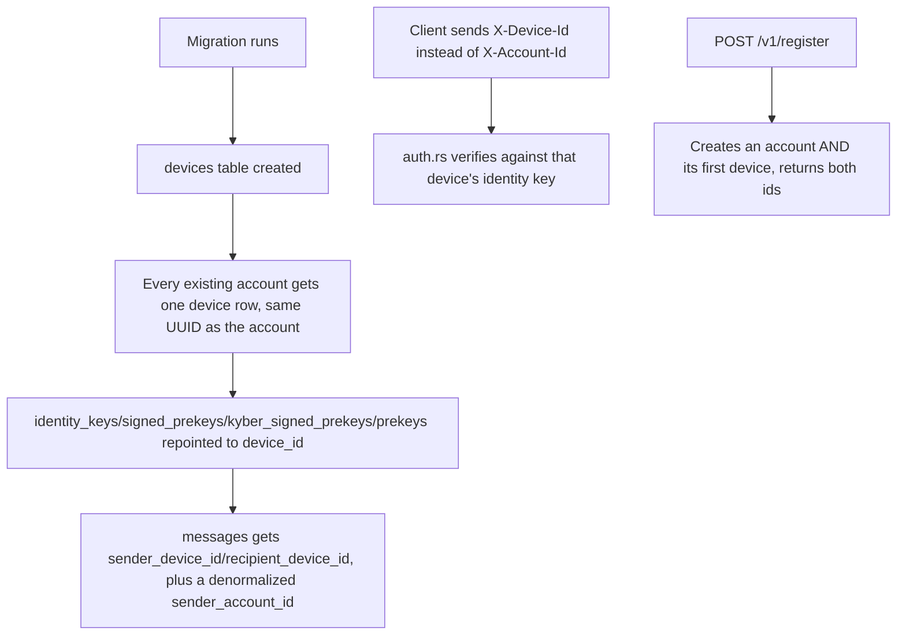

# Instruction: Server - device-scoped schema and auth

## Architecture projection

> Tree of the final files. ✅ create · ✏️ modify · ❌ delete

```txt
.
└── server/
    ├── migrations/0004_create_devices.sql   ✅
    ├── src/auth.rs                          ✏️
    ├── src/routes/register.rs               ✏️
    ├── src/routes/prekey_bundle.rs          ✏️
    └── src/routes/messages.rs               ✏️
```

## User Journey



## Tasks to do

### 1) Migration: devices table, repoint the device-scoped tables

1. `migrations/0004_create_devices.sql`:
   - `CREATE TABLE devices (id UUID PRIMARY KEY DEFAULT gen_random_uuid(), account_id UUID NOT NULL REFERENCES accounts(id) ON DELETE CASCADE, label TEXT NOT NULL, created_at TIMESTAMPTZ NOT NULL DEFAULT now())`
   - Backfill: `INSERT INTO devices (id, account_id, label) SELECT id, id, 'Primary' FROM accounts` - reuses each account's own id as its primary device's id
   - For `identity_keys`, `signed_prekeys`, `kyber_signed_prekeys`, `prekeys`: `RENAME COLUMN account_id TO device_id`, `DROP CONSTRAINT <table>_account_id_fkey`, `ADD CONSTRAINT <table>_device_id_fkey FOREIGN KEY (device_id) REFERENCES devices(id) ON DELETE CASCADE` (exact original constraint names verified against the live database - see plan.md)
   - For `messages`: `RENAME COLUMN sender_account_id TO sender_device_id`, `RENAME COLUMN recipient_account_id TO recipient_device_id`, drop+recreate both FKs to point at `devices(id)`, drop+recreate `messages_recipient_idx` on `recipient_device_id`; then `ADD COLUMN sender_account_id UUID REFERENCES accounts(id) ON DELETE CASCADE`, backfill it via `UPDATE messages SET sender_account_id = (SELECT account_id FROM devices WHERE devices.id = messages.sender_device_id)`, then `SET NOT NULL` - denormalized so the client's poll can filter "is this from my open conversation's contact" without the server joining on every fetch

### 2) Device-scoped auth

1. `src/auth.rs`: rename `AuthenticatedAccount` to `AuthenticatedDevice`, its inner `Uuid` is now a `device_id`; `account_id_header` reads `X-Device-Id` instead of `X-Account-Id`; `verify()`'s identity lookup becomes `SELECT public_key FROM identity_keys WHERE device_id = $1`

### 3) Registration creates an account and its first device

1. `src/routes/register.rs`: insert into `devices` (new random id, `label = 'Primary'`) right after inserting into `accounts`, use that device's id (not the account id) for the `identity_keys`/`signed_prekeys`/`kyber_signed_prekeys`/`prekeys` inserts; `RegisterResponse` gains a `device_id` field alongside `account_id`

### 4) Prekey bundle and messages become device-scoped

1. `src/routes/prekey_bundle.rs`: route param renamed from account to device (`/v1/devices/:device_id/prekey-bundle` - path change lands in phase 2 alongside the new device-listing endpoint it depends on); every query filters on `device_id` instead of `account_id`
2. `src/routes/messages.rs`: `SendMessageRequest.recipient_account_id` becomes `recipient_device_id`; the INSERT also writes `sender_account_id` (looked up from the caller's own device row, or passed straight through since `AuthenticatedDevice` could resolve it - simplest: a small join query `SELECT account_id FROM devices WHERE id = $1`); `fetch_messages` filters `WHERE recipient_device_id = $1` and returns both `sender_device_id` and `sender_account_id` per message

## Test acceptance criteria

| Task | Acceptance criteria              |
| ---- | -------------------------------- |
| 1 | The migration applies cleanly to the existing dev database with its current test data intact - `cargo test` still passes unmodified as a smoke check before any Rust code changes |
| 2 | A request signed with a device's identity key but sent with the wrong `X-Device-Id` is rejected, same as the existing account-id mismatch test already covers |
| 3 | Registering returns both a new `account_id` and a new `device_id`, and they are different UUIDs |
| 4 | Sending a message addressed to a `recipient_device_id` and fetching it back from that device returns the sender's both `sender_device_id` and `sender_account_id` |
