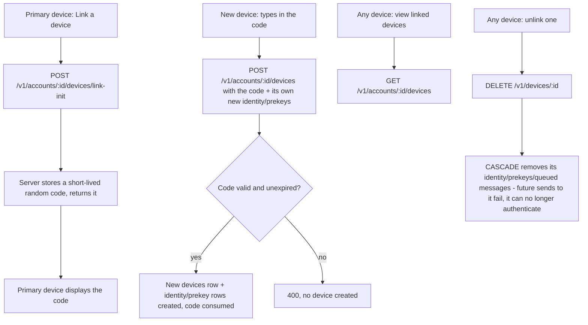

# Instruction: Server - device link/list/unlink endpoints

## Architecture projection

> Tree of the final files. ✅ create · ✏️ modify · ❌ delete

```txt
.
└── server/
    ├── migrations/0005_create_pending_device_links.sql   ✅
    ├── src/routes/devices.rs                             ✅
    └── src/routes/mod.rs                                 ✏️
```

## User Journey



## Tasks to do

### 1) Pending link codes

1. `migrations/0005_create_pending_device_links.sql`: `CREATE TABLE pending_device_links (code TEXT PRIMARY KEY, account_id UUID NOT NULL REFERENCES accounts(id) ON DELETE CASCADE, expires_at TIMESTAMPTZ NOT NULL)`
2. `src/routes/devices.rs`: `link_init(AuthenticatedDevice, Path(account_id))` - verifies the caller's own device belongs to `account_id` (403 otherwise), generates a random code (e.g. 8 hex chars from a CSPRNG - short enough to type, long enough that guessing it inside the expiry window isn't practical), inserts it with a 5-minute `expires_at`, returns `{ code }`

### 2) Complete a link

1. `src/routes/devices.rs`: `complete_link(Path(account_id), Json(body))` - **unauthenticated** (the new device has no credentials yet); body carries `{ code, label, identity_public_key, registration_id, signed_prekey, kyber_signed_prekey, one_time_prekeys }`, the same shape `register.rs` already validates (reuse its signature-verification logic, don't duplicate it - extract a shared helper both routes call); looks up `pending_device_links` by `code`, rejects if missing/expired/`account_id` mismatch, then inserts the new `devices` row plus its identity/prekey rows (same pattern as `register.rs`'s transaction) and deletes the consumed code; returns `{ device_id }`

### 3) List and unlink

1. `src/routes/devices.rs`: `list_devices(AuthenticatedDevice, Path(account_id))` - **no ownership check**, same visibility as the existing prekey-bundle endpoint: a sender needs to discover a *contact's* device list to fan out to it, which is a different use case from "show me my own devices" and can't both be same-account-restricted. Returns `[{ id, label, created_at }]` for every device under the account. Named trade-off, not hidden: this means a contact can see your device count/labels/link-times, a bit more metadata than real Signal exposes (which only reveals device addresses, not labels or counts) - acceptable at this project's scale, revisit if it matters
2. `src/routes/devices.rs`: `unlink_device(AuthenticatedDevice, Path(device_id))` - 403 if the target device isn't in the same account as the caller (this one *does* stay restricted - unlinking is a privileged, same-account-only action, unlike listing); `DELETE FROM devices WHERE id = $1` (CASCADE handles the rest); a device is allowed to unlink itself
3. `src/routes/mod.rs`: wire `POST /v1/accounts/{id}/devices/link-init`, `POST /v1/accounts/{id}/devices`, `GET /v1/accounts/{id}/devices`, `DELETE /v1/devices/{id}`; move the prekey-bundle route to `GET /v1/devices/{id}/prekey-bundle` (phase 1's deferred path change)

## Test acceptance criteria

| Task | Acceptance criteria              |
| ---- | -------------------------------- |
| 1, 2 | A valid, unexpired code from `link-init` lets `complete_link` create a new device under the same account |
| 2 | An expired or unknown code is rejected, no device created |
| 2 | A device created via `complete_link` can immediately authenticate and fetch its own prekey bundle back |
| 3 | `list_devices` returns both the primary and the newly linked device, callable by a device from *any* account (needed for fan-out discovery) |
| 3 | After `unlink_device`, that device's identity key is gone - a request signed with its key is rejected the same way an unknown account already is |
| 3 | A device from a *different* account cannot unlink a device belonging to this one |
