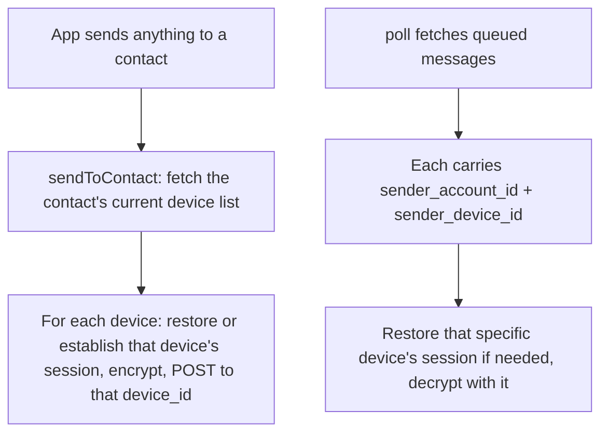

# Instruction: Web - per-device sessions and fan-out send/receive

## Architecture projection

> Tree of the final files. ✅ create · ✏️ modify · ❌ delete

```txt
.
└── web/
    └── src/
        ├── storage/keyStore.ts       ✏️
        ├── crypto/session.ts         ✏️
        ├── api/register.ts           ✏️
        ├── api/signedRequest.ts      ✏️
        ├── api/prekeyBundle.ts       ✏️
        ├── api/messages.ts           ✏️
        ├── api/devices.ts            ✅
        └── chat/conversation.ts      ✏️
```

## User Journey



## Tasks to do

### 1) Device-scoped account and auth

1. `storage/keyStore.ts`: `LocalAccount` gains `deviceId: string`
2. `api/register.ts`: capture `device_id` from the response alongside `account_id`
3. `api/signedRequest.ts`: send `X-Device-Id: account.deviceId` instead of `X-Account-Id`

### 2) Per-device session storage, restored lazily

1. `crypto/session.ts`: `openStore(identity)` drops the `contactId` param - it no longer eagerly restores one session at open time, since which devices exist isn't known until fetched. Add `restoreSession(store, key)`: imports a persisted session for `key` (a composite `accountId:deviceId` string, built by `chat/conversation.ts`) into the store if one exists and isn't already loaded, a no-op otherwise
2. `chat/conversation.ts`: add `sessionKey(contactAccountId: string, deviceId: string): string` returning `` `${contactAccountId}:${deviceId}` `` - the composite address `wasm-crypto` treats as an opaque session name (see plan.md: no Rust changes needed, this string *is* the per-device distinction)

### 3) `api/devices.ts` and per-device prekey bundles

1. `api/devices.ts` (new): `listDevices(accountId, account)` → `{id, label, createdAt}[]` (`GET /v1/accounts/:id/devices`); `linkInit(account)` → `{code}`; `completeLink(accountId, code, identity, label)` → `{deviceId}` (unauthenticated `POST`, mirrors `api/register.ts`'s body shape); `unlinkDevice(deviceId, account)` (`DELETE /v1/devices/:id`)
2. `api/prekeyBundle.ts`: `fetchPrekeyBundle` takes a `deviceId` instead of an account id, calls `GET /v1/devices/:id/prekey-bundle`
3. `api/messages.ts`: `sendMessage(recipientDeviceId, ...)`; `ReceivedMessage` gains `senderDeviceId` alongside `senderAccountId`

### 4) Fan-out send, per-device decrypt

1. `chat/conversation.ts`: new `sendToContact(contactId, plaintext, account, store)` - fetches the contact's current device list via `listDevices`, and for each device: `restoreSession`, establish one via `fetchPrekeyBundle`/`establish_session` if `store.has_session(sessionKey(...))` is still false, `store.encrypt`, `sendMessage(device.id, ...)`, `persistSession(store, sessionKey(...))`. Re-fetches the device list on every call rather than caching it, so a contact's newly linked device is included in the very next send without any extra wiring
2. Every existing send site - `sendText`, `sendFile`, `sendCallSignal`, `setDisappearingTimer`, `markFileOpened`, and the `delivered`/`read` receipt loop inside `poll()` - replaces its own `store.encrypt` + `sendMessage` + `persistSession` triplet with one call to `sendToContact`. Mechanical, same shape every time - exactly the kind of single-primitive fix the project's own conventions call for over patching each call site separately
3. `chat/conversation.ts::poll`: for each received message, `restoreSession(store, sessionKey(message.senderAccountId, message.senderDeviceId))` before decrypting with that composite key; the existing `message.senderAccountId !== contactId` drop-filter is unchanged, still comparing account ids
4. `chat/conversation.ts::startConversation`: simplifies to `openStore(account.identity)` - session establishment moves to `sendToContact`/`poll`, so there's nothing left for this function to eagerly do

## Test acceptance criteria

| Task | Acceptance criteria              |
| ---- | -------------------------------- |
| 1-4 | Two accounts, one of which has two linked devices (via the phase-2 endpoints, driven directly against the server for this phase's test): a text message sent from the single-device account is decryptable on *both* of the two-device account's devices |
| 4 | A message sent, then a new device linked, then a second message sent: the second message reaches all three devices (the two prior plus the newly linked one) without restarting anything client-side |
| 4 | Delivered/read receipts fan out the same way - the sender's message shows `read` once any one of the recipient's devices has read it |
