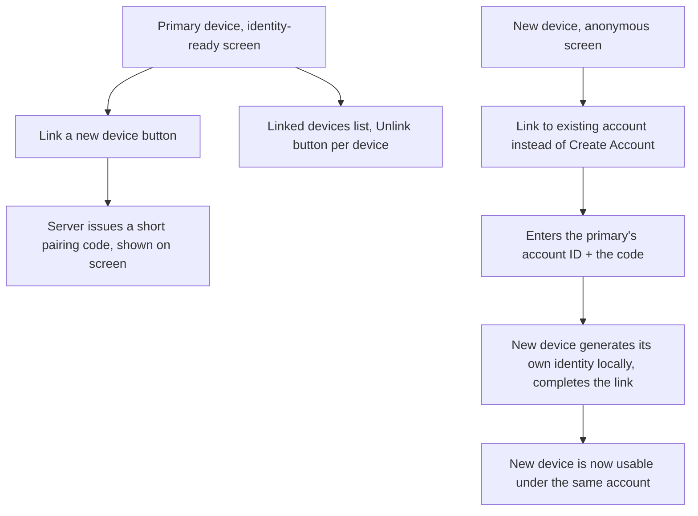

# Instruction: Web - linked-devices screen, pairing flow

## Architecture projection

> Tree of the final files. ✅ create · ✏️ modify · ❌ delete

```txt
.
└── web/
    └── src/
        ├── App.tsx                       ✏️
        └── screens/
            ├── CreateAccount.tsx         ✏️
            └── LinkedDevices.tsx         ✅
```

## User Journey



## Wireframe

```txt
Anonymous screen:
┌─────────────────────────────────────┐
│ (1) UmbraChat                        │
│     [Create Account]                 │
│     ── or ──                         │
│     [Account ID____] [Code____]      │
│     [Link This Device]               │
└─────────────────────────────────────┘

Identity-ready screen (existing SafetyNumber block, plus:)
┌─────────────────────────────────────┐
│ (2) Linked Devices                   │
│     Primary          [Unlink]        │
│     Laptop            [Unlink]       │
│     [Link a New Device]              │
│     (3) Code: A1B2C3D4 - expires 5m  │
└─────────────────────────────────────┘
```

1. Anonymous screen gains a second path next to the existing "Create Account" button - a small inline form to link this device to an already-existing account instead of creating a new one.
2. Identity-ready screen gains a device list with per-device Unlink, refreshed after any change.
3. Once "Link a New Device" is clicked, the issued code is shown plainly - the new device's user types it in manually (see plan.md: no QR image, an honest simpler equivalent).

## Tasks to do

### 1) Link this device (new-device side)

1. `screens/CreateAccount.tsx`: add account-id and code text inputs plus a "Link This Device" button, calling a new `onLink(accountId, code)` prop alongside the existing `onCreate`
2. `App.tsx`: `handleLinkDevice(accountId, code)` - generates a fresh local identity (`generateIdentity()`, same call `handleCreate` already uses), calls `completeLink(accountId, code, identity, label)`, saves the resulting `LocalAccount` (`accountId`, the returned `deviceId`, the local identity) the same way `handleCreate` does, then proceeds to the identity-ready state

### 2) Linked-devices screen (existing-device side)

1. `screens/LinkedDevices.tsx` (new): fetches and lists devices (`listDevices`) on mount; each row has an Unlink button (`unlinkDevice`, then re-fetch); a "Link a New Device" button calling `linkInit`, displaying the returned code plainly once issued
2. `App.tsx`: render `<LinkedDevices account={...} />` alongside the existing `<SafetyNumber>`/`<NewConversation>` on the identity-ready screen

## Test acceptance criteria

| Task | Acceptance criteria              |
| ---- | -------------------------------- |
| 1, 2 | Device A creates an account; device A requests a linking code; device B (a second, independent browser context with no local account) enters device A's account ID and that code; device B ends up on the identity-ready screen under the same account |
| 2 | After linking, device A's device list shows both devices; unlinking device B from device A removes it from the list |
| 1, 2 | Once unlinked, device B can no longer send a message - its identity key is gone server-side, matching phase 2's "gone the same way an unknown account already is" behavior |
