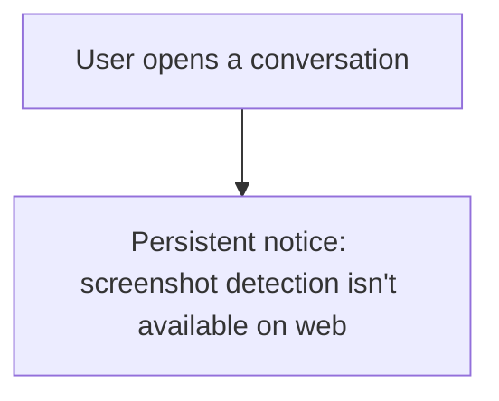

# Instruction: Web - disclosure notice

## Architecture projection

> Tree of the final files. ✅ create · ✏️ modify · ❌ delete

```txt
.
└── web/
    └── src/
        └── screens/Conversation.tsx   ✏️
```

## User Journey



## Wireframe

```txt
┌─────────────────────────────────────┐
│ (1) Conversation      ⏱ [5m ▾] 📞 🎥 │
│ (2) ⚠ Screenshots can't be detected  │
│     on web - assume anything shown   │
│     here can be captured             │
├─────────────────────────────────────┤
│ (3)                    [Hi there!] ⏱ │
│                       sent (read)    │
├─────────────────────────────────────┤
│ (4) [ Type a message... ] [📎] [Send]│
└─────────────────────────────────────┘
```

1. Header, unchanged.
2. New: a persistent, always-visible notice - not a dismissible toast.
3. Message list, unchanged.
4. Composer, unchanged.

## Tasks to do

### 1) Disclosure notice

1. `screens/Conversation.tsx`: a `<p role="note" data-testid="screenshot-disclosure">` rendered unconditionally in the conversation view, stating screenshot detection isn't available on web

## Test acceptance criteria

| Task | Acceptance criteria              |
| ---- | -------------------------------- |
| 1 | The conversation screen always shows the disclosure - present on load, not something that has to be triggered or can be dismissed away |
