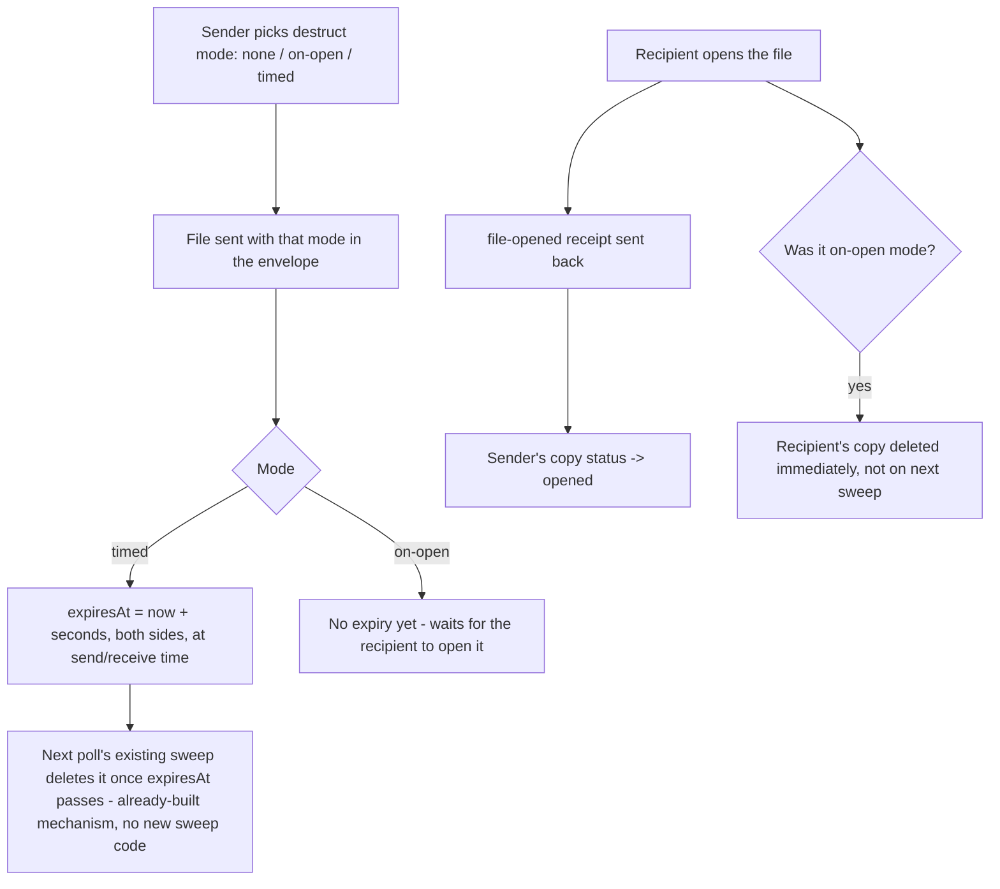

# Instruction: Destruct envelope, timed expiry, open-triggered deletion

## Architecture projection

> Tree of the final files. ✅ create · ✏️ modify · ❌ delete

```txt
.
└── web/
    └── src/
        ├── chat/conversation.ts       ✏️
        └── storage/messageStore.ts    ✏️
```

## User Journey



## Tasks to do

### 1) Destruct mode on the file envelope and status

1. `storage/messageStore.ts`: add `"opened"` to `ChatMessage["status"]` union (`"sent" | "delivered" | "read" | "opened"`); add `destructOnOpen?: boolean` to `ChatMessage`
2. `chat/conversation.ts`: add `destructOnOpen?: boolean` to `FileEnvelope`; add `FileOpenedEnvelope { type: "file-opened", refId: string }` to the `Envelope` union

### 2) Send and receive with a destruct mode

1. `chat/conversation.ts::sendFile`: accept an optional `destruct: { onOpen: true } | { afterSeconds: number } | undefined` parameter; when `afterSeconds` is set, compute `expiresAt = now + afterSeconds * 1000` on the pushed sent message immediately (not deferred to a read receipt, per the plan's timing decision); when `onOpen` is set, store `destructOnOpen: true`
2. `chat/conversation.ts::poll`, file-received branch: mirror the same two cases using the envelope's `destructOnOpen`/an added `timerSeconds` field on `FileEnvelope`, computed the same way disappearing-text-messages already compute a received message's `expiresAt`

### 3) Open-triggered deletion and the opened receipt

1. `chat/conversation.ts`: `markFileOpened(contactId, messageId, account, store)` - always sends a `file-opened` envelope (visibility, independent of destruct mode); if the local copy has `destructOnOpen`, deletes it from IndexedDB immediately (not via the next poll's sweep - the user is looking at it right now, no reason to wait up to 3s)
2. `chat/conversation.ts::poll`, receipt branch: handle `envelope.type === "file-opened"` by setting the matching sent message's `status` to `"opened"`

## Test acceptance criteria

| Task | Acceptance criteria              |
| ---- | -------------------------------- |
| 2 | A file sent with a 5s timer is gone from both sender's and receiver's local storage shortly after 5s, whether or not the receiver opened it |
| 3 | Opening an on-open file removes it from the receiver's storage immediately, without waiting for a poll tick |
| 3 | Opening any self-destructing file (on-open or timed) updates the sender's copy to `status: "opened"` |
| 3 | A file with no destruct mode set is unaffected by any of the above |
