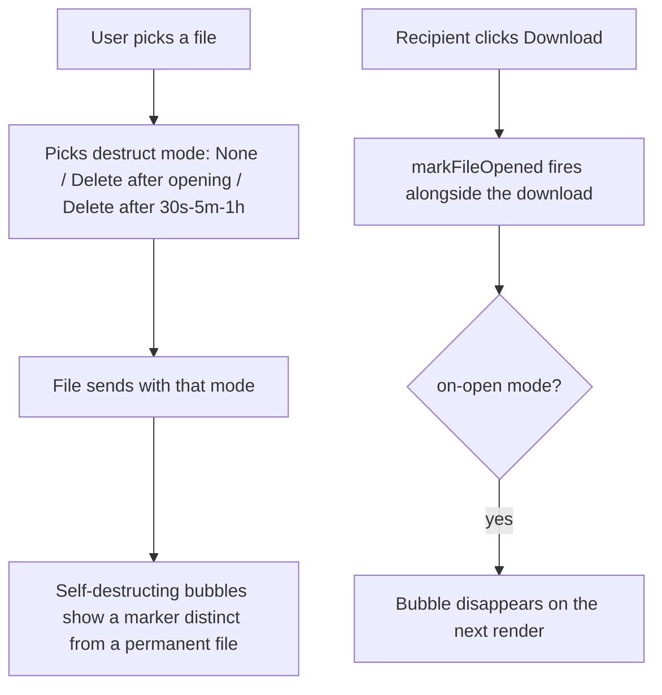

# Instruction: Web - destruct-mode picker, open-triggers-delete, status visibility

## Architecture projection

> Tree of the final files. ✅ create · ✏️ modify · ❌ delete

```txt
.
└── web/
    └── src/
        └── screens/Conversation.tsx   ✏️
```

## User Journey



## Wireframe

```txt
┌─────────────────────────────────────┐
│ (1) Conversation      ⏱ [5m ▾] 📞 🎥 │
├─────────────────────────────────────┤
│ (2)        [📎 photo.jpg 2.1MB 🔥]   │
│                  sent (opened)       │
│  [📎 report.pdf 500KB 🔥] [Download] │
├─────────────────────────────────────┤
│ (3) [ Type a message... ]            │
│     [📎] [None ▾] [Send]             │
└─────────────────────────────────────┘
```

1. Header, unchanged.
2. A self-destructing file bubble shows a 🔥 marker next to its name/size, same placement style as the existing disappearing-message ⏱ marker; a sent one's status line can now read `(opened)`.
3. Composer: a small destruct-mode picker next to the file-attach button - None / Delete after opening / 30s / 5m / 1h. Applies to the next file picked, mirrors the timer picker's shape.

## Tasks to do

### 1) Destruct-mode picker

1. `screens/Conversation.tsx`: a `<select data-testid="file-destruct-mode">` (None / On open / 30s / 5m / 1h) next to the file input; `handleFilePick` reads its current value and passes the resulting `destruct` option through to `onSendFile`

### 2) Marker and open-triggers-delete

1. `screens/Conversation.tsx`'s `FileMessage`: render a 🔥 marker (`data-testid="destruct-marker"`) when `destructOnOpen` or `timerSeconds`/`expiresAt` is set on a file message
2. The Download `<a>`'s `onClick` calls `onOpenFile(message.id)` (new prop, wired to `markFileOpened`) - doesn't `preventDefault`, the native download still proceeds

## Test acceptance criteria

| Task | Acceptance criteria              |
| ---- | -------------------------------- |
| 1, 2 | Sending a file with "Delete after opening" set shows the 🔥 marker on both sides; after the recipient clicks Download, it's gone from their message list and the sender's copy shows `(opened)` |
| 1, 2 | Sending a file with a 30s timer: gone from both sides shortly after 30s regardless of whether it was opened |
| 1 | A file sent with destruct mode "None" shows no marker and is unaffected |
