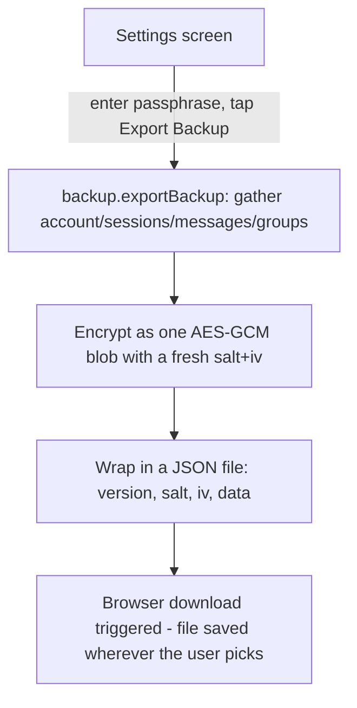

# Instruction: Backup primitive + export UI

## Architecture projection

```txt
.
└── web/src/
    ├── crypto/
    │   ├── vault.ts ✏️ export deriveKey, replaceBytes, restoreBytes (currently private)
    │   └── backup.ts ✅ new: exportBackup(passphrase) -> Blob
    └── screens/
        └── Settings.tsx ✏️ new "Backup" panel: passphrase + Export Backup button, triggers a file download
```

## User Journey



## Wireframe

```txt
┌───────────────────────────────────────┐
│ (1) ← Menu      Settings                │
├───────────────────────────────────────┤
│ (2) LOCAL ENCRYPTION  [unchanged panel] │
├───────────────────────────────────────┤
│ (3) BACKUP                              │
│  ┌─────────────────────────────────┐   │
│  │ (4) Passphrase     [..........] │   │
│  │ (5) [ Export Backup ]            │   │
│  │ (6) Saves an encrypted file you  │   │
│  │     keep yourself. Forgetting    │   │
│  │     this passphrase means the    │   │
│  │     backup can't be restored.    │   │
│  └─────────────────────────────────┘   │
└───────────────────────────────────────┘
```

1. Back to menu + title (unchanged).
2. Existing local-encryption panel from #27, untouched.
3. New section heading.
4. Backup passphrase - deliberately a separate field/state from the local-encryption passphrase above (see plan Decisions).
5. Triggers gather -> encrypt -> download in one step.
6. Sets expectations plainly: no recovery path if the passphrase is lost, matching this app's existing no-server-backup philosophy rather than glossing over it.

## Tasks to do

### `1)` Export `deriveKey`/`replaceBytes`/`restoreBytes` from `vault.ts`

1. Change the three from private (`function ...`) to `export function ...` - no behavior change, just visibility. `backup.ts` needs the exact same PBKDF2 params and Uint8Array<->base64 walking, and duplicating either would drift out of sync with the local-encryption version over time.

### `2)` `crypto/backup.ts`: gather, encrypt, package

1. `exportBackup(passphrase: string): Promise<Blob>` - reuse the same enumeration `enableEncryption` already does: `loadAccount`, every session via `listSessionContactIds`/`loadSession`, every message bucket via `listMessageContactIds`/`loadMessages`, `loadAllGroups`. Bundle into one `{ account, sessions, messages, groups }` snapshot object.
2. Generate a fresh random 16-byte salt and 12-byte IV (independent of any local-encryption salt already in use - see plan Decisions), derive a key via the now-exported `deriveKey`, `replaceBytes` the snapshot, `JSON.stringify`, AES-GCM encrypt.
3. Wrap as `{ version: 1, salt: base64, iv: base64, data: base64 }`, return as a `Blob` with `type: "application/json"`. The `version` field exists so a future format change can detect and reject (or migrate) an old backup file cleanly instead of failing confusingly.

### `3)` `Settings.tsx`: Backup panel

1. New panel: a passphrase input (separate local state from the encryption-enable form above it) and an "Export Backup" button.
2. On click: `exportBackup(passphrase)`, then trigger a real browser download (`URL.createObjectURL` + a programmatically-clicked `<a download>`, then `URL.revokeObjectURL` - standard pattern, no new dependency) with a filename like `umbrachat-backup-<date>.json`.
3. Loading/error states follow the same pattern already used by the encryption-enable form right above it in the same file.

## Test acceptance criteria

| Task | Acceptance criteria                                                                                                  |
| ---- | ------------------------------------------------------------------------------------------------------------------------ |
| 1... | `backup.ts` imports `deriveKey`/`replaceBytes`/`restoreBytes` from `vault.ts` rather than reimplementing them            |
| 2... | `exportBackup` produces a `Blob` whose JSON-parsed content has `version`, `salt`, `iv`, `data` fields, and `data` decrypts (with the right passphrase, via the same derivation) back into a snapshot containing the real account/sessions/messages/groups that existed before export |
| 3... | Clicking "Export Backup" in the running app actually downloads a file (verifiable in a browser test via Chromium's download event) |
