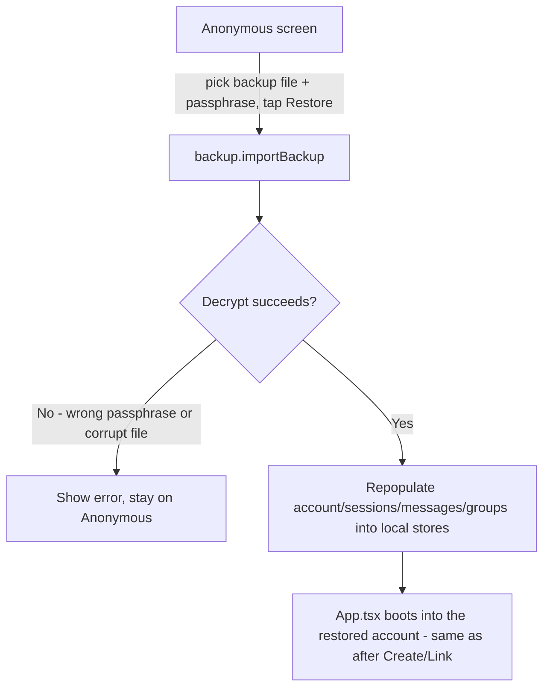

# Instruction: Restore UI + boot wiring

## Architecture projection

```txt
.
└── web/src/
    ├── crypto/
    │   └── backup.ts ✏️ add importBackup(file, passphrase) -> LocalAccount
    ├── screens/
    │   └── CreateAccount.tsx ✏️ third panel: "Lost your device? Restore from Backup"
    └── App.tsx ✏️ handleRestore, passed down as a new onRestore prop
```

## User Journey



## Wireframe

```txt
┌───────────────────────────────────────┐
│ (1) UmbraChat                           │
│  [ Create Account ]                     │
├───────────────────────────────────────┤
│ (2) Already have an account?            │
│  [ Account ID ] [ Pairing code ]        │
│  [ Link This Device ]                   │
├───────────────────────────────────────┤
│ (3) Lost your device?                   │
│  ┌─────────────────────────────────┐   │
│  │ (4) [ Choose backup file ]       │   │
│  │ (5) Passphrase     [..........] │   │
│  │ (6) [ Restore from Backup ]      │   │
│  └─────────────────────────────────┘   │
└───────────────────────────────────────┘
```

1-2. Existing panels, unchanged.
3. New section heading, worded for the actual situation the user is in (device lost/broken), not generic "restore" jargon.
4. Native file picker, scoped to `.json`.
5. The backup's own passphrase - independent of everything else on this screen.
6. Disabled until both a file is chosen and a passphrase is entered.

## Tasks to do

### `1)` `backup.ts`: import/decrypt/repopulate

1. `importBackup(file: File, passphrase: string): Promise<LocalAccount>` - `JSON.parse(await file.text())`, check `version === 1` (throw a clear "unsupported backup file" error otherwise, not a confusing decrypt failure), derive the key from the stored salt, AES-GCM decrypt (catch failure as "wrong passphrase or corrupted file" - GCM's own auth tag is the correctness check, same pattern as `vault.unlock`).
2. `restoreBytes` the decrypted snapshot back into `{ account, sessions, messages, groups }`.
3. Write everything into the local stores via the existing `saveAccount`/`saveSession`/`saveMessages`/`saveGroup` functions, then return the restored `account` so the caller can boot into it immediately without a second read.

### `2)` `CreateAccount.tsx`: restore panel

1. File input (`accept=".json"`) + passphrase field + submit button, disabled until both are present.
2. Calls a new `onRestore(file, passphrase)` prop - mirrors how `onCreate`/`onLink` are already wired, same loading/error prop shapes reused, no new state-management pattern introduced.

### `3)` `App.tsx` wiring

1. `handleRestore(file, passphrase)`: calls `importBackup`, then boots into the returned account the same way `handleCreate`/`handleLinkDevice` already do (`enterIdentityReady`) - reuse, don't reimplement the post-restore navigation.
2. Errors (wrong passphrase, corrupt file, unsupported version) surface through the same `error` state already shown on this screen.

## Test acceptance criteria

| Task | Acceptance criteria                                                                                                 |
| ---- | ----------------------------------------------------------------------------------------------------------------------- |
| 1... | Importing a file produced by phase 1's `exportBackup` with the correct passphrase restores the exact same account/sessions/messages/groups that were exported |
| 1... | A wrong passphrase, a corrupted file, or an unsupported `version` each produce a clear, distinct-enough error rather than a generic crash |
| 2... | The Restore button stays disabled until both a file is chosen and a passphrase is entered                               |
| 3... | After a successful restore, the app lands on the identity-ready screen showing the restored account's real safety number and account id - not a blank/broken state |
