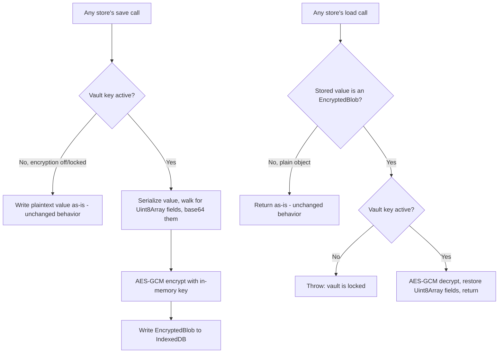

# Instruction: Vault primitive + storage wiring

## Architecture projection

```txt
.
└── web/src/
    ├── crypto/
    │   └── vault.ts ✅ key derivation, generic encrypt/decrypt-for-storage helpers, in-memory key, enable/disable migration
    └── storage/
        ├── keyStore.ts ✏️ save/load route through vault; add listSessionContactIds()
        ├── messageStore.ts ✏️ save/load route through vault; add listMessageContactIds()
        └── groupStore.ts ✏️ save/load route through vault
```

## User Journey



No UI in this phase - it's the plumbing every later phase depends on. It must be a strict no-op when encryption is off (the default), so every existing e2e suite keeps passing unmodified.

## Tasks to do

### `1)` Generic (de)serialization for arbitrary Uint8Array-bearing objects

> IndexedDB stores structured objects directly (confirmed: `keyStore.ts`/`messageStore.ts`/`groupStore.ts` all `put()` JS objects, not JSON strings) - `LocalAccount.identity` and `ChatMessage.file.bytes` both carry raw `Uint8Array` fields that `JSON.stringify` can't round-trip on its own.

1. In `web/src/crypto/vault.ts`, write `replaceBytes(value: unknown): unknown` - recursively walks objects/arrays, replaces any `Uint8Array` found with `{ __bytes: toBase64(it) }` (reuse `toBase64`/`fromBase64` from `web/src/api/codec.ts`, don't reinvent).
2. Write the inverse `restoreBytes(value: unknown): unknown` - recursively walks, replaces any `{ __bytes: string }` shape back into a real `Uint8Array`.

### `2)` Key derivation and in-memory key holding

> Passphrase → PBKDF2 → AES-GCM, native `crypto.subtle` only.

1. `deriveKey(passphrase: string, salt: Uint8Array): Promise<CryptoKey>` - `importKey("raw", passphrase bytes, "PBKDF2", false, ["deriveKey"])` then `deriveKey({ name: "PBKDF2", salt, iterations: 600_000, hash: "SHA-256" }, ..., { name: "AES-GCM", length: 256 }, false, ["encrypt", "decrypt"])`. `extractable: false` - the raw key bytes must never be readable back out, even by this app's own code.
2. Module-level `let activeKey: CryptoKey | null = null` - the ONLY place this key lives. Never written to `localStorage`/IndexedDB/anywhere persistent.
3. `isVaultActive(): boolean` returns `activeKey !== null`.

### `3)` Encrypt/decrypt-for-storage helpers used by every store

1. `encryptForStorage<T>(value: T): Promise<T | EncryptedBlob>` - if `!activeKey`, return `value` unchanged (passthrough). Otherwise: `replaceBytes(value)`, `JSON.stringify`, UTF-8 encode, AES-GCM encrypt with a fresh random 12-byte IV, return `{ __encrypted: true, iv: base64, data: base64 }`.
2. `decryptFromStorage<T>(stored: unknown): Promise<T | undefined>` - if `stored` isn't shaped like `EncryptedBlob` (no `__encrypted` marker), return it as-is (plaintext passthrough - covers encryption-off AND any pre-migration legacy record). If it IS an `EncryptedBlob` and `!activeKey`, throw (`"vault is locked"` - the unlock gate in phase 3 must prevent this path from ever being hit in practice). Otherwise decrypt, `JSON.parse`, `restoreBytes`, return.

### `4)` Wire all three stores through the vault

> Every existing `save*`/`load*` function's IndexedDB call is unchanged; only what gets `put()`/what `get()` returns changes.

1. `keyStore.ts`: `saveAccount` encrypts the value before `put`; `loadAccount` decrypts what `get` returns. Same for `saveSession`/`loadSession`.
2. Add `listSessionContactIds(): Promise<string[]>` to `keyStore.ts` via `objectStore.getAllKeys()` on `SESSION_STORE` - needed by phase 2's migration, doesn't exist today (only single-key lookup by a known `contactId` exists).
3. `messageStore.ts`: `saveMessages`/`loadMessages` wrapped the same way. Add `listMessageContactIds(): Promise<string[]>` via `getAllKeys()` - same gap, needed for migration.
4. `groupStore.ts`: `saveGroup`/`loadGroup`/`loadAllGroups` wrapped the same way - no new listing function needed, `loadAllGroups()` already exists.

## Correction made during implementation

`groupStore.ts` used an in-line `keyPath: "id"` object store - not anticipated when this phase was planned. Encrypting a whole `Group` record would hide its own `id` field inside the ciphertext, but IndexedDB needs a keyPath store's key field readable in plaintext to index the record at all; `put()` throws if you also pass an explicit key on a keyPath store. Fixed by bumping `DB_VERSION` to 2 and migrating to an out-of-band key (`put(stored, group.id)`, matching `keyStore.ts`/`messageStore.ts`'s existing pattern) - read every existing record out via a cursor before replacing the store, inside the same `onupgradeneeded` transaction. First implementation of the migration also had a real bug caught by the group-messaging e2e suite: a brand-new install (`oldVersion === 0`) took the "create with keyPath" branch and returned early, skipping the very migration meant to move *away* from keyPath - fixed by making a fresh install go straight to the target (non-keyPath) schema instead of creating the old one just to migrate off it a moment later.

## Test acceptance criteria

| Task | Acceptance criteria                                                                                             |
| ---- | ------------------------------------------------------------------------------------------------------------------ |
| 1... | A `Uint8Array` nested anywhere inside an object survives `restoreBytes(JSON.parse(JSON.stringify(replaceBytes(x))))` byte-for-byte |
| 2... | `deriveKey` with the same passphrase+salt twice produces functionally identical keys (same encrypt/decrypt round trip works both times); a different passphrase produces a key that fails to decrypt data from the first |
| 3... | With no active key, `encryptForStorage`/`decryptFromStorage` are pure passthroughs - every existing e2e suite passes unmodified, since encryption is off by default |
| 4... | With an active key manually set (test-only), saving then loading an account/session/message/group round-trips correctly, and the raw IndexedDB record is NOT human-readable plaintext (inspect via a test harness, not just via the app's own read path) |
