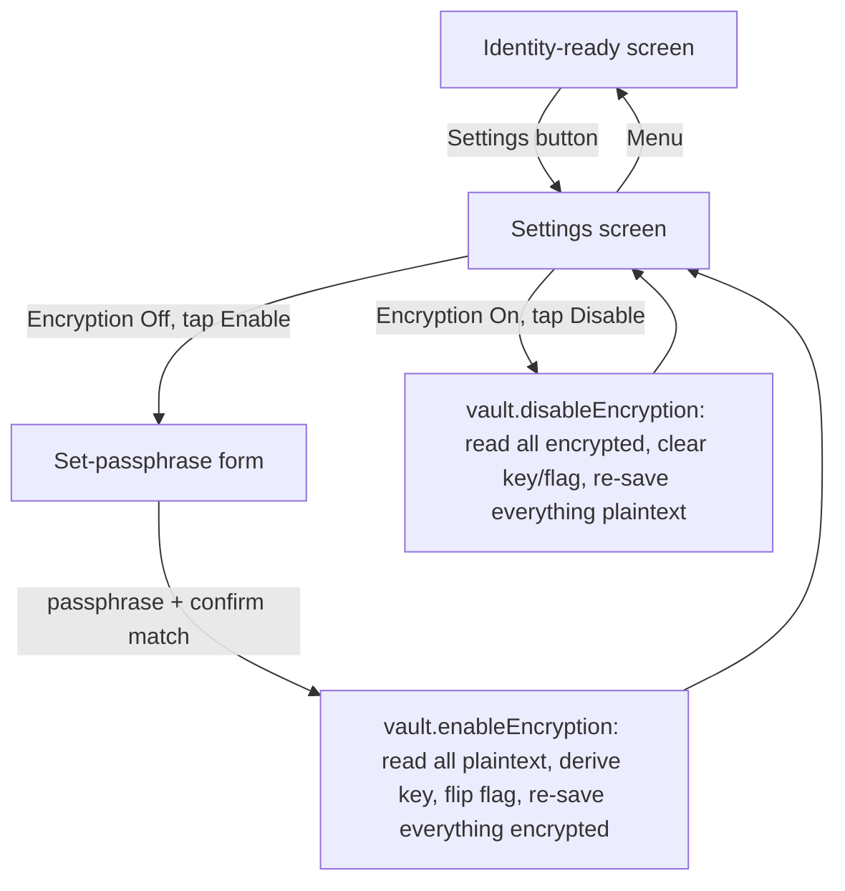

# Instruction: Settings screen + enable/disable flow

## Architecture projection

```txt
.
└── web/src/
    ├── crypto/
    │   └── vault.ts ✏️ add enableEncryption(passphrase), disableEncryption()
    ├── screens/
    │   └── Settings.tsx ✅ new: encryption status panel + enable/disable sub-flow
    └── App.tsx ✏️ new "settings" screen status, entry point from identity-ready, back navigation
```

## User Journey



## Wireframe

```txt
┌───────────────────────────────────────┐
│ (1) ← Menu      Settings                │
├───────────────────────────────────────┤
│ (2) LOCAL ENCRYPTION                    │
│  ┌─────────────────────────────────┐   │
│  │ (3) Encrypt data on this device  │   │
│  │     Off                [Enable] │   │
│  │ (4) Protects your messages and   │   │
│  │     keys if this device is lost  │   │
│  │     or seized.                   │   │
│  └─────────────────────────────────┘   │
└───────────────────────────────────────┘

-- after tapping Enable --

┌───────────────────────────────────────┐
│ (5) Set a passphrase                    │
│  ┌─────────────────────────────────┐   │
│  │ (6) Passphrase     [..........] │   │
│  │ (7) Confirm        [..........] │   │
│  │ (8) [ Enable Encryption ]        │   │
│  │ (9) ⚠ If you forget this,        │   │
│  │     your messages can't be       │   │
│  │     recovered.                   │   │
│  └─────────────────────────────────┘   │
└───────────────────────────────────────┘
```

1. Back to menu + title.
2. Section heading.
3. Current status + the one action available for that state (Enable when off, Disable when on).
4. Plain-language explanation of what the toggle actually protects against.
5-9. The one-time setup form: passphrase, confirmation (must match before the button enables), submit, and an explicit warning that there's no recovery path - matches the project's existing no-backup design (issue for account recovery is separate, not solved here).

## Tasks to do

### `1)` `vault.ts`: enable/disable migration

> Correctness depends on ordering: read old data while the OLD state is still active, THEN flip the key/flag, THEN write new data (getting this backwards means trying to decrypt-with-the-new-key data that's still in the old format, or vice versa).

1. `enableEncryption(passphrase: string): Promise<void>`: read the current account (`loadAccount`), all session ids (`listSessionContactIds`) and their bytes (`loadSession` each), all message-bucket ids (`listMessageContactIds`) and their arrays (`loadMessages` each), all groups (`loadAllGroups`) - all while `activeKey` is still `null`, so these reads are plaintext passthroughs. Generate a random 16-byte salt, derive the key, store the salt (base64) and an `umbrachat:vaultEnabled` flag in `localStorage` (not secret, just needed to re-derive the same key next unlock), set `activeKey`. Re-save every value read in step one - now encrypted, since `activeKey` is set.
2. `disableEncryption(): Promise<void>`: same read-everything step, but this time via the *encrypted* path (key is still active), then clear `activeKey` and remove both `localStorage` entries, then re-save everything - now plaintext.
3. No extra passphrase re-entry required to disable: reaching Settings already required unlocking this session, and re-prompting here is friction without a clear benefit the project's "off by default, minimal friction" stance already argues against.

### `2)` `screens/Settings.tsx`

1. Panel showing current status (`vault.isVaultActive()` - wait, this only reflects *this session's* unlock state, not whether the feature is enabled at all; use a persisted `vault.isEncryptionEnabled()` reading the `localStorage` flag, since Settings should show "On"/"Off" correctly even if this exact render happens to run before/after an unlock check elsewhere) and the one relevant action button.
2. Enable sub-flow: passphrase + confirm fields, disabled submit until they match and meet a minimum length (8 characters - long enough to not be trivially guessable, short enough not to push users toward writing it on a sticky note). Calls `enableEncryption`, then returns to the status view.
3. Disable: single button, calls `disableEncryption()` directly, no confirmation dialog (matches point 3 above - already an authenticated, unlocked session).

### `3)` `App.tsx` wiring

1. Add `"settings"` to the `Status` union (holds `account`, nothing else new).
2. Add a "Settings" entry point on the identity-ready screen, alongside the existing `LinkedDevices`/`Groups` panels.
3. Reuse the existing `handleBackToMenu` pattern for returning to identity-ready.

## Test acceptance criteria

| Task | Acceptance criteria                                                                                                    |
| ---- | --------------------------------------------------------------------------------------------------------------------------- |
| 1... | After `enableEncryption`, every previously-plaintext record (account, at least one session, at least one message bucket, at least one group) is stored as an `EncryptedBlob` in IndexedDB, and reading it back through the normal `load*` functions still returns the original value unchanged |
| 1... | After `disableEncryption`, every record is back to plain IndexedDB objects, readable even with `activeKey` reset to `null` |
| 2... | The Enable button stays disabled until both passphrase fields are non-empty, match each other, and meet the minimum length |
| 3... | Settings is reachable from the identity-ready screen and "← Menu" returns to it, matching the existing back-navigation pattern used by Conversation/GroupConversation |
