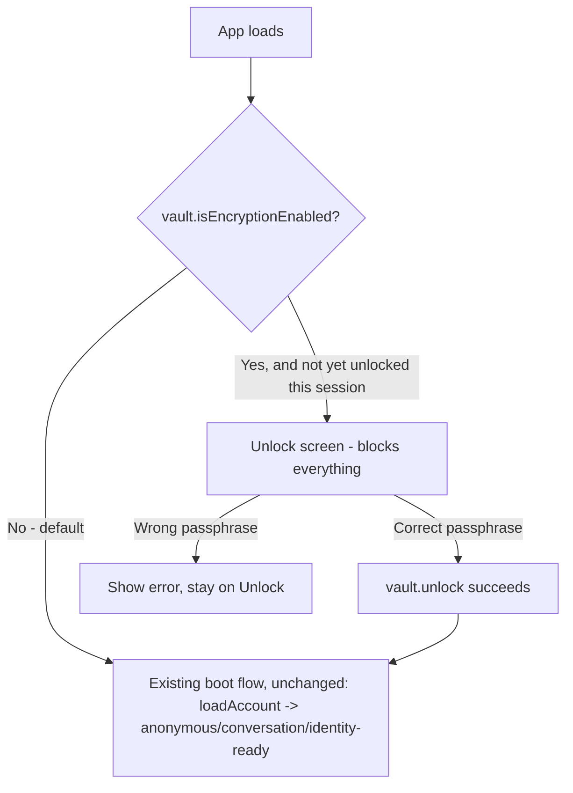

# Instruction: Unlock screen at boot

## Architecture projection

```txt
.
└── web/src/
    ├── crypto/
    │   └── vault.ts ✏️ add unlock(passphrase, verify), isEncryptionEnabled()
    ├── screens/
    │   └── Unlock.tsx ✅ new: passphrase prompt, blocks everything else until correct
    └── App.tsx ✏️ boot sequence checks isEncryptionEnabled() before calling loadAccount() at all
```

## User Journey



## Wireframe

```txt
┌───────────────────────────────────────┐
│ (1) UmbraChat — Locked                  │
│  ┌─────────────────────────────────┐   │
│  │ (2) Passphrase     [..........] │   │
│  │ (3) [ Unlock ]                   │   │
│  │ (4) Wrong passphrase. Try again. │   │
│  └─────────────────────────────────┘   │
└───────────────────────────────────────┘
```

1. Title, states plainly that the app is locked (no ambiguity about what's blocking access).
2. Passphrase input.
3. Submit.
4. Only shown after a failed attempt - not present on first load.

## Tasks to do

### `1)` `vault.ts`: unlock and the enabled-flag reader

1. `isEncryptionEnabled(): boolean` - reads the `umbrachat:vaultEnabled` `localStorage` flag set by phase 2's `enableEncryption`. Pure, synchronous, no decryption involved - safe to call before anything else on boot.
2. `unlock(passphrase: string, verify: () => Promise<unknown>): Promise<boolean>` - reads the stored salt, derives the key, tentatively sets `activeKey`, then calls `verify()` (the caller passes `loadAccount`, so this transparently exercises the real decrypt path against the real stored identity record - no separate password-hash mechanism needed, per the plan's Decisions table). If `verify()` throws (GCM auth tag failure - wrong passphrase) or returns `undefined`, reset `activeKey` to `null` and return `false`. Otherwise return `true`.

### `2)` `screens/Unlock.tsx`

1. Passphrase field + submit button + an error message shown only after a failed attempt (don't show it on first render - nothing has failed yet).
2. Calls the `onUnlock(passphrase): Promise<boolean>` prop; on `false`, sets the local error state; on `true`, does nothing further - the parent's state change (App.tsx) unmounts this screen.

### `3)` `App.tsx` boot sequence

1. Add `"locked"` to the `Status` union.
2. In the initial `useEffect`, check `vault.isEncryptionEnabled()` **before** calling `loadAccount()` at all - calling it while locked would throw (`decryptFromStorage` refuses to decrypt without an active key, per phase 1). If enabled and not already unlocked (`!vault.isVaultActive()`), set status to `"locked"` and stop - don't run the rest of the existing boot logic yet.
3. If disabled (default), or already unlocked, fall straight through to the exact existing boot logic (`loadAccount` → anonymous/conversation/identity-ready) - zero behavior change for the default, encryption-off case.
4. `handleUnlock(passphrase)`: calls `vault.unlock(passphrase, loadAccount)`; on success, re-runs the same boot logic that step 3 would have run directly (don't duplicate it - extract it into a shared function called from both places).

## Test acceptance criteria

| Task | Acceptance criteria                                                                                                     |
| ---- | ------------------------------------------------------------------------------------------------------------------------ |
| 1... | `unlock` with the correct passphrase returns `true` and leaves the vault active (a subsequent `loadAccount()` succeeds); with an incorrect one, returns `false` and leaves the vault inactive |
| 2... | Submitting a wrong passphrase shows the error message and does not navigate away from Unlock; submitting the right one does |
| 3... | With encryption never enabled, boot behaves identically to before this whole feature existed - no Unlock screen ever appears, no extra delay |
| 3... | With encryption enabled, reloading the page always shows Unlock first, even if a conversation was previously left open (`ACTIVE_CONTACT_KEY` in `localStorage`) - the key is never in `localStorage`, only in memory, so a fresh page load always starts locked |
