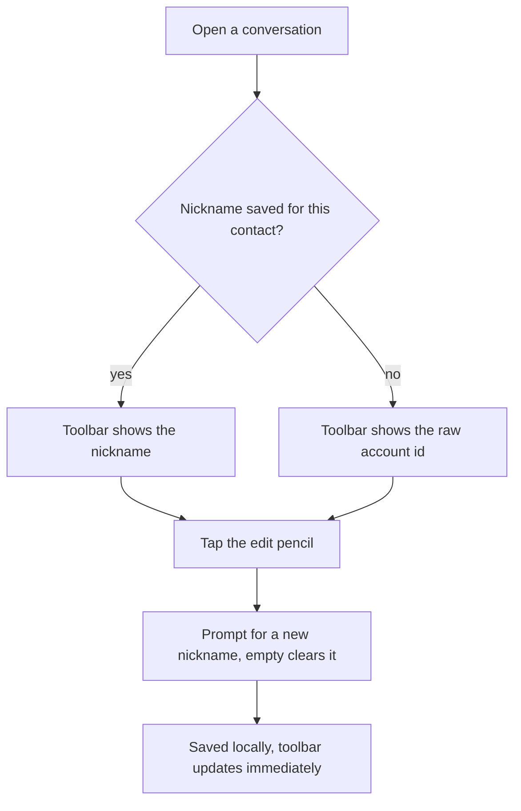

# Instruction: Nicknames: storage + UI

## Architecture projection

```txt
.
└── web/src/
    ├── storage/
    │   └── nicknameStore.ts ✅ new: loadNickname/saveNickname, unencrypted IndexedDB (like pushPrefsStore.ts)
    ├── screens/
    │   ├── Conversation.tsx ✏️ gains a `contactId` prop, shows nickname (or raw id) in the toolbar with an edit affordance
    │   └── IncomingChats.tsx ✏️ shows nickname (or raw id) in each pending-chat row
    └── App.tsx ✏️ passes `contactId` into `<Conversation>`
```

## User Journey



## Wireframe

```txt
┌───────────────────────────────────────────┐
│ (1)←Menu  (2)Bob ✎        (3)…rest unchanged│
├───────────────────────────────────────────┤
│ (4) message history                        │
└───────────────────────────────────────────┘
```

1. Back button, unchanged.
2. Nickname if set, else the raw `contactId` - pencil button opens an inline rename prompt.
3. Existing call/timer controls, untouched.
4. Existing message list, untouched.

```txt
┌───────────────────────────────────────────┐
│ (1) Bob  ·  "3 new messages"       [Open]  │
└───────────────────────────────────────────┘
```

1. `IncomingChats.tsx` row: `contactId` swapped for the nickname when one exists.

## Tasks to do

### `1)` `storage/nicknameStore.ts`

1. Same minimal IndexedDB pattern as `pushPrefsStore.ts` (own tiny `umbrachat-nicknames` database, one `nicknames` object store, no `crypto/vault.ts` involvement - purely cosmetic local metadata, never sent anywhere).
2. `loadNickname(contactId): Promise<string | undefined>` and `saveNickname(contactId, nickname: string): Promise<void>` - saving an empty/whitespace-only string deletes the record instead of storing an empty one (clears the nickname back to "no nickname set").

### `2)` `Conversation.tsx` + `App.tsx`: header

1. Add `contactId: string` to `ConversationProps`; `App.tsx` passes it (the value already exists in `state.contactId` at the call site, App.tsx:452-465, just wasn't threaded through before).
2. On mount and whenever `contactId` changes, `loadNickname(contactId)` into local state; render it in place of the current hardcoded `<h1>Conversation</h1>`, falling back to the raw `contactId` when no nickname is set.
3. A small edit button next to the name opens a `window.prompt` pre-filled with the current nickname (or empty); on confirm, `saveNickname` and update the displayed name immediately - no separate save step, no modal component needed for a single text field.

### `3)` `IncomingChats.tsx`: row label

1. For each pending chat's `contactId`, `loadNickname` it and render the nickname in place of the raw id (row already keys off `contactId`, per the explore report at `IncomingChats.tsx:17`), falling back to the raw id when unset.

## Test acceptance criteria

| Task | Acceptance criteria                                                                                                    |
| ---- | ------------------------------------------------------------------------------------------------------------------------ |
| 1... | Saving then loading a nickname for a contact id round-trips correctly; saving an empty string clears a previously-set nickname |
| 2... | Opening a conversation with no nickname set shows the raw account id in the header; after setting one via the edit button, the header updates immediately without a reload |
| 3... | A pending chat's row shows the nickname once one has been set for that sender, and the raw id otherwise                 |
