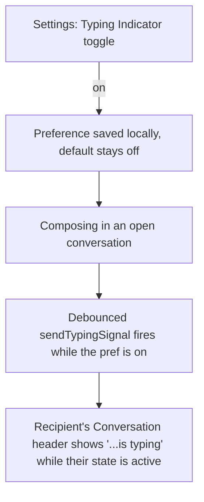

# Instruction: Typing indicator - Settings + composer UI

## Architecture projection

```txt
.
└── web/src/
    ├── storage/
    │   └── pushPrefsStore.ts ✏️ gains a second preference key (or a new tiny sibling store): loadTypingIndicatorEnabled/saveTypingIndicatorEnabled
    ├── screens/
    │   ├── Settings.tsx ✏️ new "Typing Indicator" on/off panel, matching the Notifications panel's shape
    │   └── Conversation.tsx ✏️ composer calls sendTypingSignal while the pref is on; renders "…is typing" from the phase-2 pub/sub
    └── App.tsx ✏️ passes `onTypingSignal` into `poll()`, subscribes Conversation to typing state
```

## User Journey



## Wireframe

```txt
┌───────────────────────────────────────────┐
│ (1) TYPING INDICATOR                        │
│  ┌─────────────────────────────────────┐   │
│  │ (2) Off                    [Enable]  │   │
│  │ (3) Lets people you message see when │   │
│  │     you're typing. Off by default.   │   │
│  └─────────────────────────────────────┘   │
└───────────────────────────────────────────┘
```

1. New section, placed after the Notifications panel in `Settings.tsx`.
2. Same on/off + single-button pattern as every other panel (`data-testid="typing-indicator-status"`).
3. States plainly that this reveals activity to the other party - matches the project's existing caution about presence leaks (the read-receipt fix).

```txt
┌───────────────────────────────────────────┐
│ ←Menu  Bob ✎        📞 🎥 ⏱[...]           │
│        ⋯ Bob is typing                     │
├───────────────────────────────────────────┤
│ message history                             │
└───────────────────────────────────────────┘
```

1. A small line under the toolbar, present only while the phase-2 typing-state pub/sub reports the open contact as actively typing; absent the rest of the time (no reserved empty space, no layout shift when idle).

## Tasks to do

### `1)` Preference storage

1. `loadTypingIndicatorEnabled()`/`saveTypingIndicatorEnabled(boolean)`, defaulting to `false` when unset - same shape as `loadPushDisplayLevel`/`savePushDisplayLevel`, added to `pushPrefsStore.ts` as a second key in the same small `prefs` store (no new database needed for one more boolean).

### `2)` `Settings.tsx`: Typing Indicator panel

1. On/off row identical in structure to the Notifications panel (`Settings.tsx:217-231`) but simpler - a local boolean toggle, no browser permission dance. Enable/Disable just flips and persists the pref.

### `3)` Composer wiring in `Conversation.tsx` / `App.tsx`

1. `Conversation.tsx`'s message-input `onChange` calls a debounced `sendTypingSignal` (e.g. at most once every few seconds while actively composing) **only when** `loadTypingIndicatorEnabled()` is true - checked at call time, not cached indefinitely, so flipping the Settings toggle takes effect on the next keystroke without needing to reopen the conversation.
2. `App.tsx` passes an `onTypingSignal` callback into `poll()` (phase 2's new slot) that does nothing but let the phase-2 pub/sub handle state - `App.tsx` itself doesn't need to track typing state.
3. `Conversation.tsx` subscribes to the phase-2 typing-state pub/sub for the currently-open `contactId` and renders the "is typing" line only while active; unsubscribes on unmount/contact change to avoid a stale subscription bleeding into a different conversation.

## Test acceptance criteria

| Task | Acceptance criteria                                                                                                                    |
| ---- | ------------------------------------------------------------------------------------------------------------------------------------------ |
| 1... | The preference defaults to off with nothing saved, and round-trips correctly once toggled                                              |
| 2... | Toggling the Settings panel updates its own status label immediately, matching every other panel's behavior                            |
| 3... | With the sender's pref off, no typing signal is ever sent while composing (verified directly, not just that the recipient's UI stays quiet) |
| 3... | With the sender's pref on and the recipient's conversation open, the recipient sees "is typing" while the sender composes, and it clears again after the sender stops (idle timeout) without ever appearing as a chat message in history |
