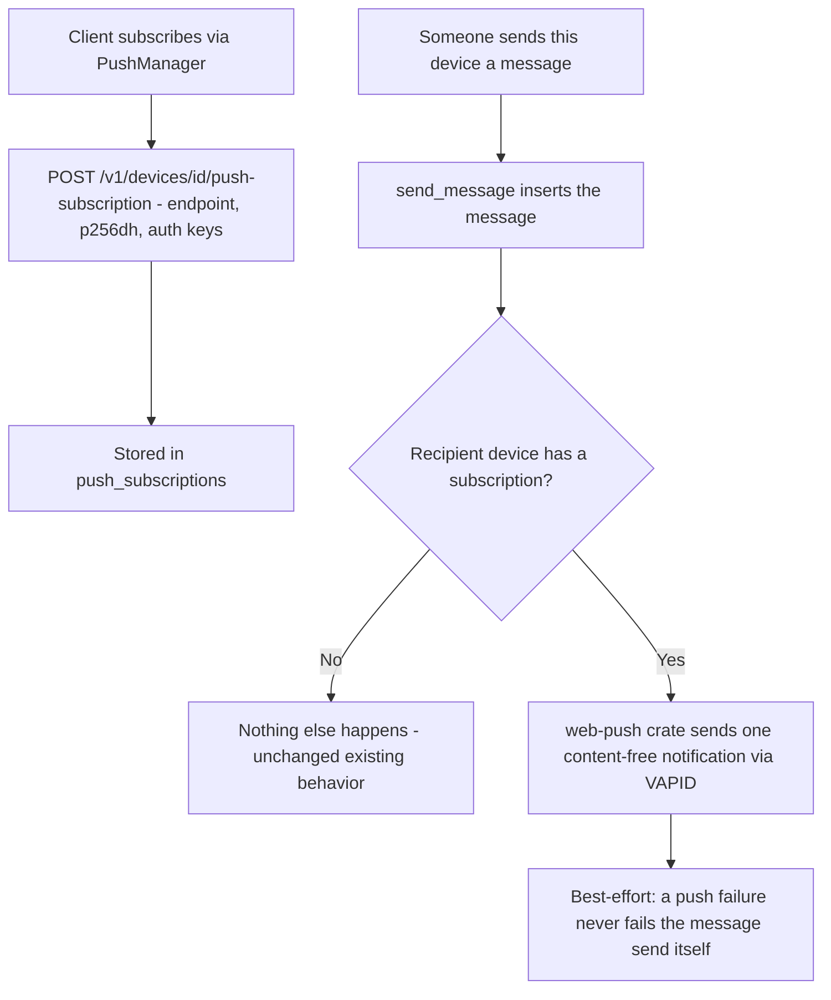

# Instruction: Server - subscriptions + push on message arrival

## Architecture projection

```txt
.
└── server/
    ├── Cargo.toml ✏️ add web-push
    ├── migrations/
    │   └── 0006_create_push_subscriptions.sql ✅
    └── src/
        ├── routes/
        │   ├── mod.rs ✏️ wire new routes
        │   ├── push.rs ✅ register_subscription, unregister_subscription
        │   └── messages.rs ✏️ send_message: best-effort push after insert
        └── config.rs (or similar) ✏️ VAPID private key from env
```

## User Journey



No UI in this phase - server only.

## Tasks to do

### `1)` `push_subscriptions` migration

1. `device_id UUID REFERENCES devices(id) ON DELETE CASCADE` (unlinking a device should drop its subscription automatically - reuse cascade, don't hand-roll cleanup), `endpoint TEXT NOT NULL`, `p256dh TEXT NOT NULL`, `auth TEXT NOT NULL`, `created_at TIMESTAMPTZ NOT NULL DEFAULT now()`. One device has at most one active subscription - `PRIMARY KEY (device_id)`, a re-subscribe just overwrites (`ON CONFLICT (device_id) DO UPDATE`).

### `2)` VAPID key setup

1. Generate a VAPID keypair once (the `web-push` crate or a small one-off script) - document the exact command used, don't just assert it works.
2. Private key: server-side env var only (matches how the DB connection string etc. are already configured), never logged, never returned by any endpoint.
3. Public key: exposed to the client build via `VITE_VAPID_PUBLIC_KEY`, following the exact pattern `VITE_API_BASE`/`VITE_STUN_URL` already use.

### `3)` `routes/push.rs`

1. `register_subscription` - `AuthenticatedDevice`-gated (same pattern as every other device-scoped endpoint), body is `{ endpoint, keys: { p256dh, auth } }` (the real shape `PushSubscription.toJSON()` produces client-side - verify this exact shape against the client's actual `subscribe()` call in phase 4, don't assume). Upserts into `push_subscriptions`.
2. `unregister_subscription` - same-device-only, deletes the row. Called when the user disables notifications from Settings.

### `4)` `messages.rs`: fire on arrival

1. After `send_message` successfully inserts the message, look up `recipient_device_id`'s row in `push_subscriptions`. If none, do nothing (today's unchanged behavior for every device that hasn't opted in).
2. If a subscription exists, send one Web Push notification via the `web-push` crate with a fixed, content-free payload (no sender id, no message id, no hint of content - literally just enough for the Service Worker's `push` handler to know "wake up"). Best-effort: log a failure, never turn it into an error response for the sender - a broken/expired push subscription must not break normal messaging.
3. An expired/gone subscription (the push service itself returns 404/410) should delete the stored subscription row, so a stale one doesn't keep getting retried forever.

## Correction made during implementation

`register_subscription` initially used `AuthenticatedDevice` (which always verifies the request signature against an empty body - correct only for bodyless GET/DELETE calls, like `unregister_subscription`) even though it also receives a real JSON body. Every test signing a real body against this endpoint failed with 401. Fixed by switching to `Authenticated<RegisterSubscriptionRequest>` (verifies against the actual body hash), matching the exact pattern `messages.rs`'s `send_message` already uses for its own JSON-body POST. Caught by the new test suite, not assumed correct from reading the code.

VAPID keypair generated via `cargo run --example gen_vapid_keys` (a throwaway example added at `server/examples/gen_vapid_keys.rs`, reusing the `web-push`/`jwt-simple` crates already a dependency rather than pulling in separate key-gen tooling - `VapidKey` itself isn't a public export of `web_push`, so the public key is derived by round-tripping through `VapidSignatureBuilder::from_base64_no_sub(...).get_public_key()` instead). `jwt-simple` needed `--no-default-features --features pure-rust` - its plain `cargo add` default pulled in `boring`/BoringSSL (a native C library needing `cmake`), unnecessary for a one-off key generation.

## Test acceptance criteria

| Task | Acceptance criteria                                                                                                    |
| ---- | ---------------------------------------------------------------------------------------------------------------------- |
| 1... | Unlinking a device (existing `DELETE /v1/devices/{id}`) also removes its push subscription, verified by querying the table directly, not just trusting the cascade |
| 3... | A device with no subscription can send/receive messages exactly as before - zero behavior change for anyone who hasn't opted in |
| 4... | Sending a message to a subscribed (test) device triggers exactly one call into the `web-push` sending path, verified via a test double/mock, not a real push service call in the test suite |
| 4... | A push send failure does not cause `send_message` to return an error - the message is still stored and fetchable normally |
