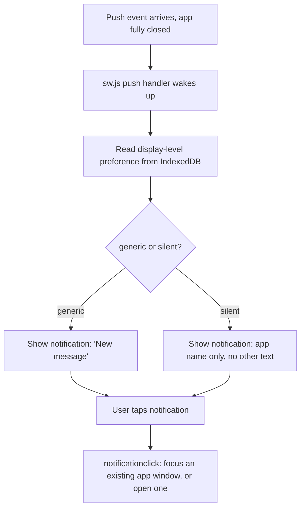

# Instruction: Service Worker - push + click handling

## Architecture projection

```txt
.
└── web/
    ├── public/
    │   └── sw.js ✅ push and notificationclick event handlers
    └── src/
        └── storage/
            └── pushPrefsStore.ts ✅ new: tiny IndexedDB store for the display-level preference, readable from a Service Worker context
```

## User Journey



## Tasks to do

### `1)` `storage/pushPrefsStore.ts`

1. A minimal IndexedDB store (same low-level pattern as `keyStore.ts`/`messageStore.ts` - no need for anything fancier) holding one value: the display-level preference (`"generic" | "silent"`). Deliberately IndexedDB, not `localStorage` - the whole reason this needs its own tiny store is that `sw.js` runs in a Service Worker context, which cannot read `localStorage` at all (confirmed browser platform constraint, not a style choice - see plan Decisions).
2. `loadPushDisplayLevel()`/`savePushDisplayLevel()`, same shape as every other store's `load*`/`save*` pair already in this codebase.

### `2)` `public/sw.js`

1. Standard `install`/`activate` boilerplate (skip waiting / claim clients, so an updated Service Worker takes over promptly rather than waiting for every tab to close first).
2. `push` event: open the same IndexedDB database `pushPrefsStore.ts` uses (a Service Worker can't `import` the app's own TS modules directly without a build step it doesn't have - this file talks to IndexedDB with the raw `indexedDB.open(...)` API directly, duplicating the minimal amount of that logic needed, not the whole store abstraction). Read the display-level preference, call `self.registration.showNotification(...)` with either "New message" (generic) or just the app's own name with no further text (silent) - never sender, never content, matching this payload being content-free from the server in the first place regardless.
3. `notificationclick` event: `event.notification.close()`, then `clients.matchAll({ type: "window" })` - focus an existing UmbraChat window if one exists, otherwise `clients.openWindow("/")`.

### `3)` Registration

1. Register the Service Worker (`navigator.serviceWorker.register("/sw.js")`) from the app's own startup path - the actual subscription flow (asking for `Notification` permission, calling `pushManager.subscribe`) is phase 4's job; this phase only makes the worker exist and be able to receive events once something does subscribe.

## Correction made during implementation

`pushPrefsStore.ts` deliberately does NOT route through `crypto/vault.ts`'s encrypt/decrypt-for-storage helpers, unlike every other store added this session - the Service Worker has no access whatsoever to the vault's in-memory key (which only ever exists in the main page's own JS execution context), so encrypting this value would make it permanently unreadable from `sw.js` the moment local encryption (#27) is enabled. Not sensitive data anyway, just a display preference. Named explicitly since it's a real exception to an otherwise-consistent pattern, not an oversight.

Verified the `push` handler's actual logic (not just that the file parses) by dispatching a synthetic `ExtendableEvent("push")` directly inside the Service Worker's own execution context via Playwright's `serviceWorkers()`/`worker.evaluate` - confirms both display levels produce the exact right `showNotification` call, with `showNotification` itself stubbed so the test doesn't need real OS notification permission.

## Test acceptance criteria

| Task | Acceptance criteria                                                                                                       |
| ---- | --------------------------------------------------------------------------------------------------------------------------- |
| 1... | Saving then loading the display-level preference round-trips correctly, from a plain page context (full store test happens once phase 4 wires the Service Worker access path too) |
| 2... | A simulated `push` event (Chromium DevTools/Playwright can trigger this without a real push service) results in a call to `showNotification` with the correct title/body for each of the two preference values, and never includes any string that isn't one of the two fixed, pre-defined texts |
| 3... | The Service Worker registers successfully in a real browser session (`navigator.serviceWorker.ready` resolves) |
