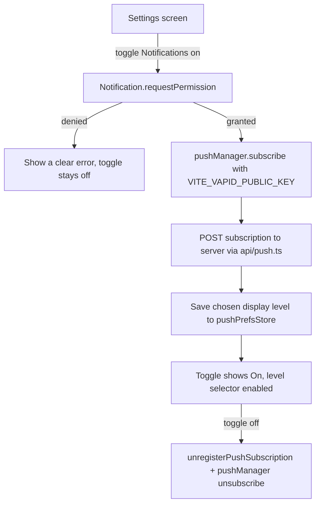

# Instruction: Settings UI + client subscription wiring

## Architecture projection

```txt
.
└── web/src/
    ├── api/
    │   └── push.ts ✅ new: registerPushSubscription, unregisterPushSubscription
    └── screens/
        └── Settings.tsx ✏️ new "Notifications" panel: enable toggle + generic/silent choice
```

## User Journey



## Wireframe

```txt
┌───────────────────────────────────────┐
│ (1) NOTIFICATIONS                       │
│  ┌─────────────────────────────────┐   │
│  │ (2) Off                [Enable] │   │
│  │ (3) When on, choose:             │   │
│  │     ( ) New message (generic)    │   │
│  │     ( ) Nothing shown (silent)   │   │
│  │ (4) Works even when the app is   │   │
│  │     closed - but only after you  │   │
│  │     add it to your home screen.  │   │
│  └─────────────────────────────────┘   │
└───────────────────────────────────────┘
```

1. New section heading, added below the existing Local Encryption and Backup panels in the same file.
2. Same on/off + single-action-button pattern the encryption panel already established.
3. Radio choice between the two in-scope display levels - defaults to generic when first enabled, changeable any time without re-subscribing.
4. States the iOS installation requirement plainly instead of leaving a confused user wondering why nothing arrives on their phone.

## Tasks to do

### `1)` `api/push.ts`

1. `registerPushSubscription(subscription: PushSubscriptionJSON, account: LocalAccount)` - `signedFetch` to `POST /v1/devices/{account.deviceId}/push-subscription`, same authenticated pattern as every other device-scoped call in `api/devices.ts`. Verify the exact JSON shape `PushSubscription.toJSON()` actually produces in a real browser before finalizing the server's expected request body (per phase 1, task 3's own note) - don't assume it matches the server's shape without checking.
2. `unregisterPushSubscription(account: LocalAccount)` - `DELETE` to the same path.

### `2)` Settings.tsx: Notifications panel

1. Enable: `Notification.requestPermission()` - if denied, show a clear error and leave the toggle off (never silently retry or nag). If granted, `navigator.serviceWorker.ready`, then `pushManager.subscribe({ userVisibleOnly: true, applicationServerKey: <VITE_VAPID_PUBLIC_KEY, base64-decoded to the Uint8Array PushManager.subscribe expects> })`, then `registerPushSubscription`, then default the display level to "generic" and save it via `pushPrefsStore`.
2. Disable: `unregisterPushSubscription`, then `pushSubscription.unsubscribe()` client-side too (both sides need cleaning up - leaving a stale subscription on the push service after the server forgets it just wastes a push call that then 404s).
3. Display-level radio: writes straight to `pushPrefsStore` on change, no separate "save" step - matches how the app already treats other lightweight local preferences (e.g. the disappearing-message timer).

## Test acceptance criteria

| Task | Acceptance criteria                                                                                                         |
| ---- | ------------------------------------------------------------------------------------------------------------------------------ |
| 1... | The request body `registerPushSubscription` sends matches exactly what the phase 1 server endpoint expects - a live round trip, not two independently-guessed shapes that happen to compile |
| 2... | Denying the permission prompt leaves the toggle Off with a visible error, not a silently-stuck "Enabling..." state              |
| 2... | Toggling Off actually removes the server-side subscription row, verified directly (not just that the UI shows Off)             |
| 3... | Changing the display level while already enabled updates what a subsequent simulated push shows, without needing to disable/re-enable |

## Correction made during implementation

Headless Chromium's real `PushManager.subscribe()` rejects unconditionally with `AbortError: Registration failed - permission denied` in this sandboxed environment, even with `Notification` permission granted via CDP and full network reachability to `fcm.googleapis.com` confirmed - a Chromium headless-mode limitation (no signed-in GCM identity), not a bug in this code. `Notification.requestPermission()` itself resolves correctly; only the actual push-service registration step fails. `e2e-push-notifications.mjs` therefore stubs `PushManager.prototype.subscribe`/`getSubscription` (matching phase 3's precedent of stubbing `showNotification`) so the test still exercises real code: the actual client → server HTTP round trip (`registerPushSubscription`'s request body verified by querying the real `push_subscriptions` Postgres row directly, not just asserting the UI says "On"), the disable cleanup path, and the display-level radio. Real end-to-end delivery through an actual push service remains verified by phone only, consistent with every other WebCrypto/notification-dependent feature this session.
